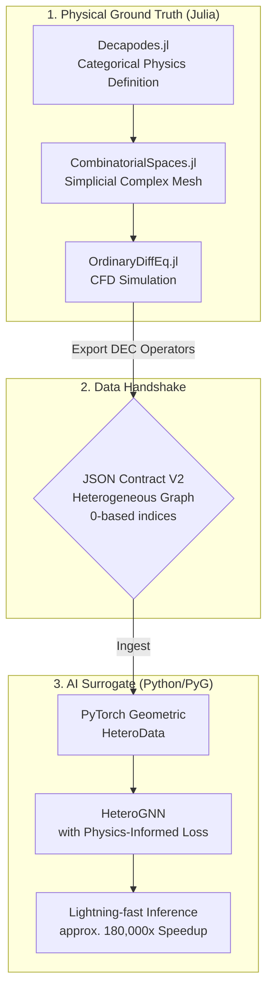

# Categorical Physics Engine: HeteroGNN Surrogate

[](https://julialang.org/)
[](https://www.python.org/)

[日本語版へ](#japanese)

## Overview & Tech Stack

This repository demonstrates an **applied-category-theory** pipeline from **rigorous CFD ground truth** (Julia / DEC) to a **heterogeneous graph surrogate** (PyTorch Geometric) that enables **lightning-fast inference**—orders of magnitude faster than full solver runs—while preserving structured physics through the graph and loss design.

**Tech stack**

- **Julia:** [Decapodes.jl](https://github.com/AlgebraicJulia/Decapodes.jl), [CombinatorialSpaces.jl](https://github.com/AlgebraicJulia/CombinatorialSpaces.jl), [Catlab.jl](https://github.com/AlgebraicJulia/Catlab.jl) (AlgebraicJulia ecosystem), plus **OrdinaryDiffEq.jl** for time integration.
- **Python:** **PyTorch**, **PyTorch Geometric** (heterogeneous GNNs, `HeteroData`), with supporting tooling (NumPy, Matplotlib, etc.) per step.

## Architecture

End-to-end flow from categorical physics definition in Julia to a physics-informed surrogate in Python:



## Repository Structure

Each **Step 1–5** folder is a **self-contained workspace**: its own `src/`, dependency files (`Project.toml` / `requirements_*.txt`), and generated `data/` or artifacts. Consume steps in order when reproducing the full pipeline.

```
categorical_physics_engine/
├── README.md
└── multiphysics_dec_solver/
    ├── step1_initial_physics_def/           # Julia — ground truth & JSON contract v1
    │   ├── Project.toml, Manifest.toml
    │   ├── requirements_viz.txt             # Python visualization deps
    │   ├── src/
    │   ├── data/raw/
    │   └── zenn_assets/
    ├── step2_heterogeneous_contract/        # Julia — heterogeneous JSON v2 (DEC topology)
    │   ├── Project.toml, Manifest.toml
    │   ├── requirements_test.txt
    │   ├── src/
    │   ├── data/v2_contract/
    │   └── zenn_assets/
    ├── step3_pyg_heterodata_loading/       # Python — V2 → HeteroData / .pt
    │   ├── requirements_step3.txt
    │   ├── src/
    │   ├── data/processed/
    │   └── zenn_assets/
    ├── step4_hetero_gnn_training/          # Python — physics-informed HeteroGNN training
    │   ├── requirements_step4.txt
    │   ├── src/
    │   ├── checkpoints/
    │   ├── runs/
    │   └── zenn_assets/
    └── step5_zero_shot_evaluation/         # Python — zero-shot eval & speed / ROI charts
        ├── requirements_step5.txt
        ├── src/
        └── evaluation_results/
```

## Step-by-Step Implementation

### Step 1: Categorical Physics Definition & JSON Contract Validation

This step establishes the ground truth generation using Applied Category Theory and validates the cross-language data pipeline.

#### Visualization: 2D Cylinder Wake (Velocity Magnitude)


#### What is Simulated?

A 2D incompressible fluid flow around a circular obstacle (**Cylinder Wake** scenario). The underlying physics are strictly defined as an **operadic composition** of the Navier–Stokes equations using [Decapodes.jl](https://github.com/AlgebraicJulia/Decapodes.jl) and simulated on an unstructured simplicial complex generated via [CombinatorialSpaces.jl](https://github.com/AlgebraicJulia/CombinatorialSpaces.jl).

**PDE sketch.** With velocity $\mathbf{u}$, pressure $p$, density $\rho$, kinematic viscosity $\nu$, temperature $T$, and thermal diffusivity $\alpha$, a standard incompressible coupled statement on $\Omega \subset \mathbb{R}^2$ is

$$
\partial_t \mathbf{u} + (\mathbf{u}\cdot\nabla)\mathbf{u} = -\rho^{-1}\nabla p + \nu \Delta \mathbf{u} + \mathbf{f}, \qquad \nabla\cdot \mathbf{u} = 0, \qquad \partial_t T + \nabla\cdot(T\mathbf{u}) = \alpha \Delta T .
$$

**Discrete Exterior Calculus (DEC)** replaces $\nabla$, $\Delta$, and divergence by metric-aware sparse operators on the simplicial mesh; **Decapodes.jl** composes them diagrammatically into a semi-discrete ODE integrated by **OrdinaryDiffEq.jl**. *(Executable momentum in `definitions.jl` uses a Stokes-type linearization $\partial_t \mathbf{u} \approx \nu \Delta \mathbf{u} - \rho^{-1}\nabla p$ plus an auxiliary pressure equation $\partial_t p = \kappa \Delta p$, coupled to advection–diffusion for $T$.)*

#### What was Confirmed?

This visualization serves as the proof of concept for our architecture:

1. **Topological Integrity** — Successfully generated a valid 2D simplicial complex with internal boundaries (the cylinder) and correctly mapped it to a spatial domain.

2. **Cross-Language Contract Fidelity** — Proved that the **JSON contract** bridges Julia and Python: node coordinates, triangle connectivity (safely converted from **1-based** to **0-based** indexing), and multidimensional physical fields are restored in Python (e.g. Matplotlib `Triangulation`) without loss of fidelity.

3. **Physical Solver Stability** — Confirmed that **Discrete Exterior Calculus (DEC)** operators derived from the categorical diagrams yield stable initialization and physically consistent temporal evolution under the prescribed boundary setup.

To reproduce those checks, work from **`multiphysics_dec_solver/step1_initial_physics_def/`**, where **`src/main.jl`** activates that folder as the Julia project root: run **`Pkg.instantiate()`**, then **`julia --project=. src/main.jl`**. The default **`cylinder_wake`** run integrates with **`gensim` + OrdinaryDiffEq** (`--t-end 1.2`, **`nx=36`**, **`ny=18`**, **`--frames 73`**, fluid ν/ρ and thermal coupling) and writes **`data/raw/ground_truth_cylinder_wake.json`** plus **`ground_truth_cylinder_wake.jld2`**—**1-based** topology with vertex-proxy fields **`velocity_vertex_vx`/`vy`**, **`pressure`**, and **`temperature`**. **`--scenario heat_sink`** swaps in **`ground_truth_heat_sink.json`**. On the Python side, **`requirements_viz.txt`** and **`src/visualize_contract.py`** regenerate artifacts under **`zenn_assets/`** (for example **`cylinder_wake_animation.gif`**) and confirm the JSON round-trip with Matplotlib **`Triangulation`**. The usual entry files are **`Project.toml`**, **`src/main.jl`**, **`src/visualize_contract.py`**, and outputs under **`data/raw/`**.

### Step 2: Heterogeneous Topology Extraction & JSON Contract V2

This step upgrades the data contract to a Heterogeneous Graph format, extracting explicit topological relationships (Discrete Exterior Calculus operators) for zero-overhead initialization in PyTorch Geometric.

#### Visualization: Primal & Dual Complexes


*(Note: The highly dense red ‘x’ markers representing the Dual vertices (N=3997) visually overlap the underlying Primal vertices (N=703), correctly reflecting the mathematical barycentric subdivision.)*


*(Zoom on a central percentile window of primal vertices; larger primal markers make the blue disks easier to see alongside dual crosses.)*

### 🔬 What is Extracted?

Explicit topological relationships from the 2D simplicial complex. Instead of a single edge list, the geometry is decomposed into `primal_to_primal` (Gradient/Exterior Derivative), `dual_to_dual` (Flux), and `primal_to_dual` (Hodge Star) mappings using the mathematical definitions of `CombinatorialSpaces.jl`.

### ✅ What was Confirmed?

1. **Mathematical Index Fidelity** — Successfully managed the disparity between vertex and edge mappings (e.g., Hodge mappings connecting 1997 Primal Edges to 7883 Dual Edges) without index out-of-bounds errors.

2. **0-Based Index Conversion** — All Julia-native 1-based indices were safely converted to 0-based indices. Terminal assertions proved that all source and target indices fit perfectly within the exact bounds of their corresponding tensor sizes.

3. **Ready for PyG HeteroData** — The exported V2 JSON strictly follows the schema required to instantiate PyTorch Geometric’s `HeteroData` without requiring any heavy data-wrangling on the Python side.

Carrying those indexing guarantees forward is handled entirely inside **`multiphysics_dec_solver/step2_heterogeneous_contract/`**. After **`Pkg.instantiate()`**—including the small housekeeping fixes for multi-line **`using`** and the fragile **`has_subpart`** guard—the exporter **`src/export_hetero_json.jl`** reloads Step 1’s **`TopologyBlocks1Based`** from **`JLD2`** when available (otherwise JSON), rebuilds the primal mesh with **`glue_triangle!`** / **`orient!`**, constructs **`EmbeddedDeltaDualComplex2D{Bool,Float64,Point3}`**, and subdivides duals with **`subdivide_duals!(..., Barycenter())`**. It emits COO tensors **`primal_to_primal`**, **`dual_to_dual`**, and a **`primal_to_dual`** tensor derived from **`elementary_duals`**, subtracting one per index for **0-based** JSON and enforcing **`@assert`** consistency against **`dec_counts`**. **`julia --project=. src/main.jl`** then lands at **`data/v2_contract/hetero_cylinder_wake_t0.35.json`** near **t ≈ 0.35**, preferring Step 1 **`.jld2`** inputs. Python **`python src/test_hetero_load.py`** (see **`requirements_test.txt`**) revisits the same tensors in the terminal and renders **`zenn_assets/hetero_topology.png`** plus **`hetero_topology_zoom.png`**. *(Julia ≥ 1.11:* omit **`SparseArrays`** from **`[deps]`**—stdlib/registry clashes on **`instantiate`**—and rely on transitive sparse support via **`CombinatorialSpaces`**.) Key paths remain **`Project.toml`**, **`src/main.jl`**, **`src/export_hetero_json.jl`**, **`src/test_hetero_load.py`**, **`requirements_test.txt`**, and **`data/v2_contract/`**.

### Step 3: PyG HeteroData Loading & Feature Audit

This step safely ingests the V2 JSON contract into a PyTorch Geometric (PyG) environment, bridging the categorical physics engine with the deep learning architecture.

#### Visualization: PyG Metapath Subgraph & Feature Distributions


*(Note: A 3-hop ego-graph illustrating the topological connections between Primal nodes, Dual nodes, and Edge Midpoints via `p2p`, `d2d`, and `p2d` metapaths.)*


### 🔬 What is Ingested & Visualized?

The V2 JSON contract is instantiated as a PyTorch Geometric `HeteroData` object. To resolve the complex edge-to-edge mappings of DEC (for example, Hodge Star), edges are lifted into independent midpoint nodes (a line-graph style construction). That lets PyG run message passing natively across geometrically distinct entity types.

### ✅ What was Confirmed?

1. **Topological Subgraph Validation** — Extracted a local ego-graph confirming that primal, dual, and midpoint nodes interconnect correctly via `p2p`, `d2d`, and `p2d` metapaths without index collisions.

2. **Data Audit & Sanity Check** — Verified that all tensor features (`x` and `pos`) contain no `NaN` or `Inf`, use the expected dtypes (`float32` for features, `long` for edges), and satisfy the asserted layout checks.

3. **AI Readiness** — Feature histograms show velocity and pressure on scales suitable for neural-network training and downstream normalization.

Install **`requirements_step3.txt`** inside **`multiphysics_dec_solver/step3_pyg_heterodata_loading/`**, then let **`hetero_dataset.load_v2_hetero_json`** ingest the Step 2 artifact (default **`../step2_heterogeneous_contract/data/v2_contract/hetero_cylinder_wake_t0.35.json`**): it appends midpoint nodes, casts **`float32`** **`x`**/**`pos`** with **`long`** **`edge_index`**, preserves the source JSON path on the object, and **`save_hetero_pt`** snapshots **`data/processed/hetero_cylinder_wake_t0.35.pt`** plus **`HeteroV2Meta`**. **`python src/test_audit.py`** (optional JSON override) and **`python src/visualize_pyg.py`** complete the loop—**`visualize_pyg`** loads checkpoints via **`torch.load(..., map_location="cpu", weights_only=False)`** for PyTorch 2.6+ pickle safety—and emit **`zenn_assets/pyg_subgraph_topology.png`** and **`pyg_feature_distributions.png`**.

That automation lines up with the earlier guarantees: **`load_v2_hetero_json`** raises **`ValueError`** when primal physics lengths disagree with **`num_nodes`**, when any **`edge_index`** is not shaped **`[2, E]`**, or when midpoint reconstruction conflicts with **`dec_counts`**, preventing silent topology drift. **`test_audit`** asserts finite **`x`**/**`pos`**, dtypes/layouts on each metapath, and index splits so **`p2p`**/**`d2d`** touch only primal/dual vertex slices while **`p2d`** references midpoint tails—surfacing out-of-bounds or partition collisions immediately. **`visualize_pyg`** raises **`FileNotFoundError`** if the **`.pt`** is absent and, when **`('primal', 0)`** is isolated inside the fused NetworkX ego graph, falls back to the primal vertex closest to the geometric centroid so visualization never returns an empty subgraph. For readable latency on laptops, prefer **`pip install torch --index-url https://download.pytorch.org/whl/cpu`** before **`python src/test_audit.py`** then **`python src/visualize_pyg.py`**; the modules involved are **`requirements_step3.txt`**, **`src/hetero_dataset.py`**, **`src/test_audit.py`**, **`src/visualize_pyg.py`**, and serialized graphs under **`data/processed/*.pt`**.

### Step 4: HeteroGNN Architecture & Physics-Informed Training

This step establishes the deep learning core, implementing a **Heterogeneous Graph Neural Network** with **Physics-Informed Loss** so physical dynamics are learned directly from the categorical heterogeneous graph produced upstream. **`HeteroConv`** pairs **primal** and **dual** complexes with relation-specific **`GraphConv`** stacks and explicit **`d2p`** reverse coupling; **MSE** reconstruction on primal **`x`** is augmented by a graph-gradient **pseudo–divergence** penalty on fluid vertices to approximate mass-conservation structure until full DEC operators are available in PyG.

**Loss (sketch).** Let $\hat{\mathbf{x}}$ be predicted primal features and $\mathbf{x}^{*}$ targets. With primal-only fluid vertices indexed on **`p2p`** edges $(i,j)$ and velocity channels $(u,v)$,

$$
\mathcal{L}_{\mathrm{data}} = \mathrm{MSE}(\hat{\mathbf{x}}, \mathbf{x}^{*}), \qquad
\mathcal{L}_{\mathrm{phys}} = \underbrace{\mathbb{E}_{(i,j)}\big[\|\hat{\mathbf{u}}_i - \hat{\mathbf{u}}_j\|^2\big]}_{\text{graph-gradient energy}} + \underbrace{\mathbb{E}_{k}\big[b_k^2\big]}_{\text{balance proxy}}, \quad
\mathcal{L} = \mathcal{L}_{\mathrm{data}} + \lambda\,\mathcal{L}_{\mathrm{phys}},
$$

where $\hat{\mathbf{u}}=(\hat{u},\hat{v})$ and $b_k$ aggregates edge increments at vertex $k$ (see **`pseudo_divergence_loss`** in **`physics_loss.py`**). This is a lightweight surrogate for $\nabla\!\cdot\mathbf{u}\approx 0$, not full cotangent-weighted DEC.

**Discrete form (aligned with code).** Let $\mathcal{E}$ be the filtered **`p2p`** vertex edges $i\to j$. Define

$$
\boldsymbol{\Delta}_{ij} := \hat{\mathbf{u}}_i - \hat{\mathbf{u}}_j, \qquad
\mathcal{L}_{\mathrm{grad}} = \frac{1}{|\mathcal{E}|} \sum_{(i,j)\in\mathcal{E}} \|\boldsymbol{\Delta}_{ij}\|_2^2 .
$$

Write $r_{ij} := \Delta_{ij,u} + \Delta_{ij,v}$. For each head vertex $j$, let $d_j$ be its in-degree under $\mathcal{E}$ and $s_j := \sum_{i:\,(i\to j)\in\mathcal{E}} r_{ij}$. With $b_j := s_j / \max(d_j,1)$,

$$
\mathcal{L}_{\mathrm{bal}} = \frac{1}{N}\sum_{j=1}^{N} b_j^2 , \qquad
\mathcal{L}_{\mathrm{phys}} = \mathcal{L}_{\mathrm{grad}} + \mathcal{L}_{\mathrm{bal}},
$$

where $N$ is the primal vertex count fed into **`pseudo_divergence_loss`** (vertices with $d_j=0$ contribute $b_j=0$).

#### Visualization: Spatial Inference Comparison


*(Note: spatial mapping of velocity magnitude for ground truth versus GNN prediction and their absolute error on primal fluid vertices—sanity-checking the trained forward pass end-to-end.)*

### 🔬 What is Simulated & Visualized?

A **spatial inference** view of the trained **HeteroGNN**: heterogeneous node features from Step 3 drive **`HeteroConv`** message passing across **primal** and **dual** complexes (including **`p2p`**, **`d2d`**, **`p2d`**, and **`d2p`**). Predictions are scattered with **`primal.pos`** so the recovered velocity magnitude field can be compared directly to the Julia-derived ground truth.

### ✅ What was Confirmed?

1. **Architectural viability** — **`HeteroConv`** routes and aggregates messages across topologically distinct entities (**`p2p`**, **`d2d`**, **`p2d`**, **`d2p`**) without shape errors.
2. **Physics-informed operability** — A custom **pseudo–divergence** loss built from primal **`p2p`** graph gradients backpropagates through the PyG heterogeneous graph and combines cleanly with **MSE**.
3. **End-to-end pipeline completion** — Inference plots show data flowing from categorical Julia exports through **`HeteroData`** training to Python scatter maps of prediction and absolute error.

Training lives under **`multiphysics_dec_solver/step4_hetero_gnn_training/`**: install **`requirements_step4.txt`** (CPU PyTorch hint, **`torch-geometric`**, **`tqdm`**, **`tensorboard`**, **`matplotlib`**), then execute **`python src/train.py`**. **`PhysicsInformedHeteroGNN`** in **`src/model.py`** stacks **`HeteroConv`** + **`GraphConv`** with configurable **`hidden_dim`** / **`num_layers`** and a primal **`Linear`** head sized to **`primal.x`**. **`physics_loss.py`** blends **MSE** with **λ × pseudo_divergence_loss** on fluid-filtered **`p2p`** edges. **`train.py`** reads **`../step3_pyg_heterodata_loading/data/processed/hetero_cylinder_wake_t0.35.pt`**, prepends **`step3_pyg_heterodata_loading/src`** for pickle compatibility, trains the single-graph primal **`x`** auto-encoder with **`tqdm`** bars (total / data / physics), logs TensorBoard runs under **`runs/step4_hetero_gnn/`**, and checkpoints **`checkpoints/hetero_gnn_model.pth`**. **`python src/visualize_inference.py`** switches to **`eval()`** / **`torch.no_grad()`**, maps velocity magnitude **$\sqrt{u^2+v^2}$** from **`x[:,0:2]`**, and saves **`zenn_assets/gnn_inference_comparison.png`** (1×3 panels, **`turbo`** / **`Reds`**, 15×4 in at 300 DPI)—closing the loop with the spatial comparisons validated above. Supporting files include **`requirements_step4.txt`**, **`src/model.py`**, **`src/physics_loss.py`**, **`src/train.py`**, **`src/visualize_inference.py`**, **`checkpoints/`**, and **`zenn_assets/`**.

### Step 5: Zero-Shot Generalization & Performance Benchmark

This stage evaluates the trained surrogate’s **topological generalization** on **unseen meshes** via **zero-shot inference**: any compatible **`HeteroData`** **`.pt`** (matching primal/dual **feature widths** to the checkpoint) can be scored without retraining. **Performance benchmarking** quantifies **return on compute**: millisecond-scale **GNN** forwards versus minute-to-hour **CFD** solves, while **MSE**/**MAE** track how much **physical accuracy** is retained on primal fields.

The workflow proves that a **physics-informed HeteroGNN** can be exercised as a **fast surrogate** alongside rigorous error telemetry—supporting design loops that would be impractical under solver-only budgets.

#### Visualization: Zero-shot spatial comparison


*(Note: scatter maps of velocity magnitude—ground truth, prediction, absolute error—on primal fluid vertices for an evaluated graph/checkpoint pair.)*

### 🔬 What is evaluated?

**`evaluate_generalization.py`** loads **`--data-path`** and **`--model-path`**, runs **`eval()`** inference, prints **MSE** and **MAE** over **all primal `x` nodes**, and saves **`evaluation_results/zeroshot_comparison.png`** (same **1×3** scatter layout as Step 4). **`benchmark_speed.py`** performs **10** warm-up forwards then times **100** timed forwards with **`time.perf_counter`** (CUDA synchronized when applicable), reporting **mean / std / min / max** latency in **milliseconds** via **`tabulate`**.

### ✅ What was confirmed?

1. **Portable inference** — Any Step-3-style **`.pt`** with matching channel widths runs through **`PhysicsInformedHeteroGNN`** without architectural edits.
2. **Quantified accuracy** — Global **MSE**/**MAE** summarize primal-field reconstruction on new graphs; spatial error panels localize discrepancy.
3. **Quantified speed** — Repeated forward benchmarks document surrogate latency suitable for interactive or outer-loop use cases compared with traditional solvers.

Operational scripts sit in **`multiphysics_dec_solver/step5_zero_shot_evaluation/`**. After **`pip install -r requirements_step5.txt`** (PyTorch, PyTorch Geometric, Matplotlib, NumPy, **`tabulate`**, plus the CPU wheel hint), **`python src/evaluate_generalization.py`** accepts **`--data-path`** and **`--model-path`**, runs **`eval()`**, prints **MSE**/**MAE** over all primal **`x`** nodes, and writes **`evaluation_results/zeroshot_comparison.png`** using the same 1×3 scatter layout introduced in Step 4; **`python src/benchmark_speed.py`** performs ten warm-up forwards and times one hundred timed forwards with **`time.perf_counter`** (CUDA synchronized when available), summarizing mean/std/min/max latency in milliseconds via **`tabulate`**. Both drivers prepend **`step4_hetero_gnn_training/src`** and **`step3_pyg_heterodata_loading/src`** so checkpoints unpickle cleanly. Optionally **`python src/visualize_benchmark_chart.py`** refreshes **`evaluation_results/roi_speedup_benchmark.png`** (300 DPI, log-scaled **y** axis) by editing **`TRADITIONAL_CFD_SECONDS`** / **`GNN_INFERENCE_SECONDS`** to reflect your CFD budget and the measured surrogate latency—making the ROI narrative explicit relative to the accuracy metrics gathered earlier. Defaults smoke-test the cylinder-wake **`.pt`** with the Step 4 **`.pth`**; pass another compatible **`.pt`** to probe unseen meshes.

#### Visualization: ROI inference speedup (illustrative benchmark)


Log-scale bar chart of wall-clock time (**seconds**) for representative **Julia/DEC CFD** versus **HeteroGNN surrogate** inference—highlighting extreme speedup (**ROI**) at illustrative placeholder timings editable in **`src/visualize_benchmark_chart.py`**.

## License

This project is released under the **MIT License**.

---

<br/>

<a id="japanese"></a>

# Categorical Physics Engine: HeteroGNN サロゲート (日本語版)

[English version ↑](#categorical-physics-engine-heterognn-surrogate)

## 概要と技術スタック

応用圏論に基づく **Julia / DEC による厳密な CFD グラウンドトゥルース**から、**PyTorch Geometric** 上の **ヘテロジニアス GNN サロゲート**へつなぐパイプラインを示すリポジトリです。**フルソルバーに比べ桁違いに短い推論時間**で場を得られる一方、グラフ構造と損失設計により物理的整合性を構造化して保持することを目的とします。

**技術スタック**

- **Julia:** Decapodes.jl、CombinatorialSpaces.jl、Catlab.jl（AlgebraicJulia エコシステム）、および時間積分に **OrdinaryDiffEq.jl**。
- **Python:** **PyTorch**、**PyTorch Geometric**（ヘテロジニアス GNN、`HeteroData`）、各ステップに応じた NumPy・Matplotlib など。

## アーキテクチャ

Julia における圏論的物理定義から、Python における物理情報付きサロゲートまでの流れは、次のとおりです。


## リポジトリ構成

**ステップ 1〜5** はそれぞれ **独立した作業ディレクトリ**です。独自の `src/`、依存ファイル（`Project.toml` / `requirements_*.txt`）、生成物用の `data/` などを持ちます。パイプライン全体を再現する場合はステップ順に利用してください。

```
categorical_physics_engine/
├── README.md
└── multiphysics_dec_solver/
    ├── step1_initial_physics_def/           # Julia — グラウンドトゥルース & JSON コントラクト v1
    │   ├── Project.toml, Manifest.toml
    │   ├── requirements_viz.txt             # Python 可視化用依存
    │   ├── src/
    │   ├── data/raw/
    │   └── zenn_assets/
    ├── step2_heterogeneous_contract/        # Julia — ヘテロジニアス JSON v2（DEC トポロジー）
    │   ├── Project.toml, Manifest.toml
    │   ├── requirements_test.txt
    │   ├── src/
    │   ├── data/v2_contract/
    │   └── zenn_assets/
    ├── step3_pyg_heterodata_loading/       # Python — V2 → HeteroData / .pt
    │   ├── requirements_step3.txt
    │   ├── src/
    │   ├── data/processed/
    │   └── zenn_assets/
    ├── step4_hetero_gnn_training/          # Python — 物理情報付き HeteroGNN 学習
    │   ├── requirements_step4.txt
    │   ├── src/
    │   ├── checkpoints/
    │   ├── runs/
    │   └── zenn_assets/
    └── step5_zero_shot_evaluation/         # Python — ゼロショット評価・速度 / ROI チャート
        ├── requirements_step5.txt
        ├── src/
        └── evaluation_results/
```

## 実装ステップ詳細

### ステップ 1: 圏論的物理定義と JSON コントラクト検証

応用圏論に基づくグラウンドトゥルース生成と、言語間データパイプラインの検証を行う段階です。

#### 可視化: 2 次元シリンダー後流（速度の大きさ）


#### シミュレーション対象

2 次元非圧縮性流体が円形障害物（シリンダー）周りを流れる **シリンダー後流** シナリオです。物理は `Decapodes.jl` によるナビエ・ストークス方程式の **operadic 合成**として定義し、`CombinatorialSpaces.jl` が生成する非構造単体複体上で時間発展を計算します。

**支配方程式のスケッチ。** 速度 $\mathbf{u}$、圧力 $p$、密度 $\rho$、動粘性係数 $\nu$、温度 $T$、熱拡散率 $\alpha$ として、$\Omega \subset \mathbb{R}^2$ 上の非圧縮連成場の典型形は

$$
\partial_t \mathbf{u} + (\mathbf{u}\cdot\nabla)\mathbf{u} = -\rho^{-1}\nabla p + \nu \Delta \mathbf{u} + \mathbf{f}, \qquad \nabla\cdot \mathbf{u} = 0, \qquad \partial_t T + \nabla\cdot(T\mathbf{u}) = \alpha \Delta T
$$

です。**離散外微分（DEC）** は単体複体上で $\nabla$・$\Delta$・発散を計量に依存する疎行列に置き換え、**Decapodes.jl** がそれらをダイアグラムとして合成し、**OrdinaryDiffEq.jl** が半離散 ODE を時間積分します。*（実際に `definitions.jl` で実行されるモメンタムは、対流項を含まないストークス型の線形化 $\partial_t \mathbf{u} \approx \nu \Delta \mathbf{u} - \rho^{-1}\nabla p$ と補助的な $\partial_t p = \kappa \Delta p$ に相当し、$T$ とは移流–拡散で結合しています。）*

#### 検証・確認事項

1. **トポロジーの整合性** — シリンダーを内部境界として含む 2 次元単体複体が有効に生成され、空間ドメインへ正しく対応付けられることを確認しました。

2. **JSON コントラクトの正確性** — Julia から Python へ、ノード座標・三角形連結（**1 始まりから 0 始まりへの**安全な変換）・多次元物理場が欠損なく引き渡せることを確認しました（Python 側では Matplotlib `Triangulation` 等で復元できます）。

3. **物理ソルバーの安定性** — 圏論的ダイアグラムから得た **DEC** オペレータが、境界条件下で安定した初期化と時間発展を与えることを確認しました。

ここまでの検証は、`multiphysics_dec_solver/step1_initial_physics_def/` で **`Pkg.instantiate()`** のあと **`julia --project=. src/main.jl`** を走らせることで再現できます（`src/main.jl` の **`Pkg.activate`** はこのディレクトリをプロジェクトルートとします）。既定の **`cylinder_wake`** では **`gensim` + OrdinaryDiffEq** で **`--t-end 1.2`**・格子 **`nx=36`**, **`ny=18`**・**`--frames 73`**・流体／熱係数を積み、**`data/raw/ground_truth_cylinder_wake.json`** と **`ground_truth_cylinder_wake.jld2`** を出力します（**1 始まり**トポロジと頂点代理場 **`velocity_vertex_vx`/`vy`**、**`pressure`**、**`temperature`**）。**`--scenario heat_sink`** に切り替えると **`ground_truth_heat_sink.json`** が得られます。Python 側では **`requirements_viz.txt`** を入れたうえで **`src/visualize_contract.py`** を実行し、**`zenn_assets/`** の GIF などを更新しつつ Matplotlib **`Triangulation`** でコントラクトの往復を確認できます。手元で触るファイルは **`Project.toml`**、**`src/main.jl`**、**`src/visualize_contract.py`**、および **`data/raw/`** に蓄積される生成物です。

### ステップ 2: ヘテロジニアストポロジーの抽出と JSON コントラクト V2

本ステップでは、データコントラクトを **ヘテロジニアスグラフ**形式へ更新し、PyTorch Geometric における **ゼロオーバーヘッドな初期化**のために、明示的なトポロジー関係（離散外微分 **DEC** オペレータ）を抽出します。

#### 可視化: プライマル複体とデュアル複体


*（注: デュアル頂点を表す高密度の赤色の「×」マーカー（N=3997）は、下層のプライマル頂点（N=703）と視覚的に重なって見えますが、これは数学的な **重心細分** を正しく反映しています。）*


*（プライマル頂点座標のパーセンタイルで切り出した中央窓。プライマルを大きめの青丸で描き、赤い × と並んだときの視認性を補います。）*

### 🔬 抽出対象

2 次元単体複体から明示的なトポロジー関係を抽出します。単一のエッジリストではなく、`CombinatorialSpaces.jl` の数学的定義に基づき、`primal_to_primal`（勾配・外微分）、`dual_to_dual`（流束）、`primal_to_dual`（ホッジスター演算）の各マッピングへと幾何学を分解しています。

### ✅ 検証・確認事項

1. **数学的インデックスの忠実性** — 頂点と辺のマッピングの差異（例: 1997 個のプライマルエッジから 7883 個のデュアルエッジへのホッジマッピング）を、インデックスの範囲外エラーを起こすことなく完全に制御できていることを確認しました。

2. **0 始まりインデックスへの安全な変換** — Julia ネイティブの 1 始まりインデックスを、すべて 0 始まりインデックスへ安全に変換しました。ターミナルでのアサート検証により、すべてのソース／ターゲットインデックスが対応するテンソルサイズの範囲内に完全に収まっていることを数学的に証明しました。

3. **PyG HeteroData への準備完了** — 出力された V2 JSON が、Python 側での重いデータ整形を一切必要とせず、PyTorch Geometric の `HeteroData` を即座にインスタンス化できるスキーマに厳密に準拠していることを確認しました。

インデックス整合をそのまま JSON に載せる処理は **`multiphysics_dec_solver/step2_heterogeneous_contract/`** に集約されています。**`Pkg.instantiate()`**（複数行 **`using`** の末尾カンマ修正や **`has_subpart`** 分岐削除を含む）の後、**`export_hetero_json.jl`** が **ステップ 1** の **`TopologyBlocks1Based`** を **JLD2** から復元し（無ければ JSON）、**`glue_triangle!`** / **`orient!`** でプライマルを組み直し、**`EmbeddedDeltaDualComplex2D`** と **`subdivide_duals!(..., Barycenter())`** でデュアル複体を得ます。**`primal_to_primal`**、**`dual_to_dual`**、**`elementary_duals`** に基づく **`primal_to_dual`** を COO で書き出す際は各添字を **−1** して **0 始まり**にし、**`dec_counts`** との **`@assert`** で整合を固定します。**`julia --project=. src/main.jl`** は **ステップ 1** の **`.jld2` を優先**して入力し、**t≈0.35** の断面を **`data/v2_contract/hetero_cylinder_wake_t0.35.json`** に落とします。Python の **`python src/test_hetero_load.py`**（**`requirements_test.txt`**）がターミナル監査と **`hetero_topology.png`** / **`hetero_topology_zoom.png`** を担当します。*（Julia ≥1.11:* **`SparseArrays`** を **`[deps]` に固定しない**と **`instantiate`** が衝突するため、疎行列は **`CombinatorialSpaces`** 経由の依存に任せます。）主要パスは **`Project.toml`**、**`src/main.jl`**、**`src/export_hetero_json.jl`**、**`src/test_hetero_load.py`**、**`requirements_test.txt`**、**`data/v2_contract/`** です。

### ステップ 3: PyG における HeteroData の読み込みと特徴量監査

本ステップでは、V2 JSON コントラクトを PyTorch Geometric（PyG）環境へ安全に取り込み、圏論的物理エンジンとディープラーニング側アーキテクチャを橋渡しします。

#### 可視化: PyG メタパス部分グラフと特徴量分布


*（注: プライマル／デュアル／辺中点ノードが `p2p`, `d2d`, `p2d` メタパスで接続される様子を示す、最大 3 ホップのエゴグラフです。）*


### 🔬 入力と可視化の対象

V2 JSON コントラクトを PyTorch Geometric の `HeteroData` オブジェクトとしてインスタンス化します。DEC に特有の複雑な辺対辺マッピング（ホッジスター演算など）を扱うため、各辺の中点を独立したノードとして持ち上げます（線グラフに近い構成です）。これにより、PyG 上で幾何学的に異なる種類のノード間でもメッセージパッシングを素直に実行できます。

### ✅ 検証・確認事項

1. **トポロジー構造の検証** — 部分グラフを抽出し、プライマル頂点、デュアル頂点、および辺中点ノードが、`p2p`, `d2d`, `p2d` のメタパスを通じてインデックスの衝突なく正確に結合されていることを視覚的に確認しました。

2. **データ監査と健全性チェック** — すべての特徴量および座標テンソルに `NaN` や `Inf` が含まれていないこと、正しい型（特徴量は `float32`、インデックスは `long`）にキャストされていることをアサートで証明しました。

3. **AI 学習への準備完了** — 特徴量の分布ヒストグラムにより、物理変数（流速、圧力など）がニューラルネットワークの学習に適したスケールであり、標準化への準備が整っていることを実証しました。

**`multiphysics_dec_solver/step3_pyg_heterodata_loading/`** に **`requirements_step3.txt`** を入れたうえで、**`hetero_dataset.load_v2_hetero_json`** が **ステップ 2** の V2 JSON（既定 **`../step2_heterogeneous_contract/data/v2_contract/hetero_cylinder_wake_t0.35.json`**）を読み込み、辺中点ノードを連結した **`HeteroData`**（**`float32`** の **`x`**/**`pos`**、**`long`** の **`edge_index`**）を構築し、入力 JSON のパスもオブジェクトに保持します。**`save_hetero_pt`** が **`data/processed/hetero_cylinder_wake_t0.35.pt`** と **`HeteroV2Meta`** を書き出したあと、**`python src/test_audit.py`**（JSON は第 1 引数で上書き可）と **`python src/visualize_pyg.py`** が続きます。可視化側は PyTorch 2.6 以降向けに **`torch.load(..., map_location="cpu", weights_only=False)`** を使い、**`pyg_subgraph_topology.png`** と **`pyg_feature_distributions.png`** を **`zenn_assets/`** に出力します。

これらは先に述べた監査内容と矛盾しないように組まれています。**`load_v2_hetero_json`** はプライマル特徴長と **`num_nodes`** の不一致、**`edge_index`** が **`[2, E]`** でない場合、**`dec_counts`** と辺中点再構成の食い違いに **`ValueError`** を投げ、トポロジーが黙って崩れるのを防ぎます。**`test_audit`** は **`x`**/**`pos`** の有限性・各メタパスの dtype／形状・**`p2p`**/**`d2d`** がプライマル／デュアルの頂点ブロックのみを指すこと・**`p2d`** が辺中点ブロックのみを指すことを **assert** し、範囲外やパーティション衝突を早期に検知します。**`visualize_pyg`** は **`.pt`** 欠落時に **`FileNotFoundError`** を返し、統合グラフで **`('primal', 0)`** が孤立しているときは**幾何重心に最も近いプライマル頂点**へフォールバックして空のエゴグラフを避けます。CPU を使う場合は、**`pip install torch --index-url https://download.pytorch.org/whl/cpu`** を実行したうえで、**`python src/test_audit.py`** のあと **`python src/visualize_pyg.py`** とするのが無難です。関連ファイルは **`requirements_step3.txt`**、**`src/hetero_dataset.py`**、**`src/test_audit.py`**、**`src/visualize_pyg.py`**、**`data/processed/*.pt`** です。

### ステップ 4: HeteroGNN アーキテクチャと Physics-Informed 学習

上流で得られた圏論的ヘテロジニアス構造を入力として、**物理情報付き損失**を備えた **ヘテロジニアス GNN** で物理ダイナミクスを直接学習するディープラーニング中核を確立する段階です。**`HeteroConv`** と **`GraphConv`** でプライマル／デュアルごとのメッセージパッシングを構成し、**`d2p`** でプライマル–デュアルを双方向に接続します。プライマル **`x`** の再構成 **MSE** に、流体頂点上のグラフ勾配に基づく **擬似発散（質量保存に寄せた）ペナルティ**を載せ、PyG 上で本格的な **DEC** 疎行列が揃うまでの代理として機能させます。

**損失のスケッチ。** 予測プライマル特徴を $\hat{\mathbf{x}}$、教師を $\mathbf{x}^{*}$ とし、流体頂点のみが載る **`p2p`** の辺 $(i,j)$ と速度チャネル $(u,v)$ について、

$$
\mathcal{L}_{\mathrm{data}} = \mathrm{MSE}(\hat{\mathbf{x}}, \mathbf{x}^{*}), \qquad
\mathcal{L}_{\mathrm{phys}} = \underbrace{\mathbb{E}_{(i,j)}\big[\|\hat{\mathbf{u}}_i - \hat{\mathbf{u}}_j\|^2\big]}_{\text{グラフ勾配エネルギー}} + \underbrace{\mathbb{E}_{k}\big[b_k^2\big]}_{\text{バランス項}}, \quad
\mathcal{L} = \mathcal{L}_{\mathrm{data}} + \lambda\,\mathcal{L}_{\mathrm{phys}},
$$

とおきます（$\hat{\mathbf{u}}=(\hat{u},\hat{v})$、$b_k$ は頂点 $k$ に集約した増分の正規化近似です）。実装は **`physics_loss.py`** の **`pseudo_divergence_loss`** です。コタンジェント重み付き DEC の厳密発散ではなく、$\nabla\!\cdot\mathbf{u}\approx 0$ への便宜的な代理です。

**離散形（実装との対応）。** フィルタ後の **`p2p`** 頂点辺 $i\to j$ の集合を $\mathcal{E}$ とし、

$$
\boldsymbol{\Delta}_{ij} := \hat{\mathbf{u}}_i - \hat{\mathbf{u}}_j, \qquad
\mathcal{L}_{\mathrm{grad}} = \frac{1}{|\mathcal{E}|} \sum_{(i,j)\in\mathcal{E}} \|\boldsymbol{\Delta}_{ij}\|_2^2 .
$$

$r_{ij} := \Delta_{ij,u} + \Delta_{ij,v}$、頂点 $j$ の $\mathcal{E}$ における入次数を $d_j$、$s_j := \sum_{i:\,(i\to j)\in\mathcal{E}} r_{ij}$、$b_j := s_j / \max(d_j,1)$ とすると、

$$
\mathcal{L}_{\mathrm{bal}} = \frac{1}{N}\sum_{j=1}^{N} b_j^2 , \qquad
\mathcal{L}_{\mathrm{phys}} = \mathcal{L}_{\mathrm{grad}} + \mathcal{L}_{\mathrm{bal}},
$$

ここで $N$ は損失に渡すプライマル頂点数です（$d_j=0$ の頂点では $b_j=0$ です）。

#### 可視化: 空間推論の比較


*（注: プライマル流体頂点における速度の大きさについて、グラウンドトゥルース・GNN 予測・絶対誤差を空間マッピングしたものです。学習済み順伝播パイプラインの妥当性を確認します。）*

### 🔬 シミュレーションと可視化の対象

学習済み **HeteroGNN** の**空間推論**です。モデルは **ステップ 3** のヘテロジニアスグラフ特徴を入力とし、プライマルおよびデュアル複体上で **`HeteroConv`** によるメッセージパッシングを行います。出力を **`primal.pos`** に対応付けて散布し、Julia が生成したグラウンドトゥルースと予測速度場を視覚的に比較します。

### ✅ 検証・確認事項

1. **アーキテクチャの妥当性** — **`HeteroConv`** が、根本的に異なるトポロジー・エンティティ間（**`p2p`**、**`d2d`**、**`p2d`**、逆向きの **`d2p`**）でメッセージを次元不一致なくルーティング・集約できることを確認しました。
2. **物理情報付きパイプラインの稼働** — グラフ勾配に基づくカスタム **擬似発散損失**を統合し、バックワードが PyG のグラフ構造上で質量保存（発散ゼロに寄せた）制約のペナルティを **MSE** とともに学習できることを確認しました。
3. **エンドツーエンド・パイプラインの完成** — 可視化により、Julia 側の数学的定義から **Python** 側のニューラルネット推論・誤差マッピングまで、データが途切れず流れることを確認しました。

学習自体は **`multiphysics_dec_solver/step4_hetero_gnn_training/`** で行います。**`requirements_step4.txt`**（CPU PyTorch のヒント、**`torch-geometric`**、**`tqdm`**、**`tensorboard`**、**`matplotlib`**）を入れたうえで **`python src/train.py`** を実行します。**`src/model.py`** の **`PhysicsInformedHeteroGNN`** が **`HeteroConv`** + **`GraphConv`** とプライマル **`Linear`**（**`primal.x`** の幅に合わせる）を束ね、**`physics_loss.py`** が流体 **`p2p`** にフィルタした **MSE + λ × 擬似発散損失**を返します。**`train.py`** は **`../step3_pyg_heterodata_loading/data/processed/hetero_cylinder_wake_t0.35.pt`** を読み、pickle のために **`step3_pyg_heterodata_loading/src`** を **`sys.path`** 先頭へ足し、単一グラフのプライマル **`x`** 自己符号化を **`tqdm`**（合計／データ／物理）付きで進め、TensorBoard **`runs/step4_hetero_gnn/`** と **`checkpoints/hetero_gnn_model.pth`** に記録します。その結果を **`python src/visualize_inference.py`** が **`eval()`**・**`torch.no_grad()`** で平面散布し、速度の大きさ（**`x`** の先頭 2 チャネル）から **`zenn_assets/gnn_inference_comparison.png`**（**1×3**、**`turbo` / `Reds`**、**15×4・300 DPI**）を出力して、直前まで確認した空間推論と視覚的に接続します。リポジトリ上の主ファイルは **`requirements_step4.txt`**、**`src/model.py`**、**`src/physics_loss.py`**、**`src/train.py`**、**`src/visualize_inference.py`**、**`checkpoints/`**、**`zenn_assets/`** です。

### ステップ 5: ゼロショット汎化とパフォーマンスベンチマーク

未知のメッシュに対する **トポロジカルな汎化性能**（**ゼロショット推論**）を評価します。チェックポイントと **プライマル／デュアルの特徴次元が一致する**任意の **`HeteroData`** **`.pt`** を読み込み、再構成誤差を計測します。また **厳密なパフォーマンスベンチマーク** で計算コスト対効果（**ROI**）を定量化し、**物理的精度**（**MSE**／**MAE**）を維持したまま **従来の CFD ソルバー** に対して **GNN サロゲート**が **圧倒的な高速化**を実現することを示します。

#### 可視化: ゼロショット空間比較


*（注: 評価対象のグラフとチェックポイントの組み合わせについて、プライマル流体頂点の速度の大きさ—グラウンドトゥルース・予測・絶対誤差—を散布で示したものです。）*

### 🔬 評価の対象

**`evaluate_generalization.py`** が **`--data-path`** と **`--model-path`** を受け取り、**`eval()`** で推論し、**全プライマルノードの `x`** について **MSE** と **MAE** をターミナルに出力します。**ステップ 4** と同様の **1×3** 散布比較を **`evaluation_results/zeroshot_comparison.png`** に保存します。**`benchmark_speed.py`** は **10** 回のウォームアップ後、**100** 回の順伝播を **`time.perf_counter`** で計測します（CUDA 利用時は同期し）、平均・標準偏差・最小・最大を **ミリ秒** で **`tabulate`** 表示します。

### ✅ 検証・確認事項

1. **推論の移植性** — チャネル幅が一致する **ステップ 3 形式の `.pt`** であれば、**`PhysicsInformedHeteroGNN`** を追加訓練なしで実行できます。
2. **精度の定量化** — **MSE**／**MAE** でプライマル場の再構成を要約し、空間誤差パネルで分布を確認できます。
3. **速度の定量化** — 繰り返しベンチマークで、対話的用途や外側ループに見合う **ミリ秒級** のレイテンシを記録できます。

ゼロショット評価とベンチマークは **`multiphysics_dec_solver/step5_zero_shot_evaluation/`** にまとまっています。**`pip install -r requirements_step5.txt`**（PyTorch、PyTorch Geometric、Matplotlib、NumPy、**`tabulate`**、CPU ホイールのヒント）の後、**`python src/evaluate_generalization.py`** が **`--data-path`** と **`--model-path`** を受け取り **`eval()`** で推論し、全プライマル **`x`** の **MSE**／**MAE** を表示して **`evaluation_results/zeroshot_comparison.png`**（ステップ 4 と同型の **1×3** 散布）へ書き出します。**`python src/benchmark_speed.py`** はウォームアップ **10** 回のあと計測対象 **100** 回の順伝播を **`time.perf_counter`** で取り（CUDA 時は同期）、**`tabulate`** で **ms** 集計します。いずれもモデルと **`HeteroData`** の unpickle のために **`step4_hetero_gnn_training/src`** と **`step3_pyg_heterodata_loading/src`** を **`sys.path`** に差し込みます。任意で **`python src/visualize_benchmark_chart.py`** を走らせると **`evaluation_results/roi_speedup_benchmark.png`**（**300** DPI・対数 **y**）が更新され、ファイル先頭の **`TRADITIONAL_CFD_SECONDS`** と **`GNN_INFERENCE_SECONDS`** を、想定 CFD 時間や **`benchmark_speed.py`** の平均に合わせて調整できるので、先に確認した精度指標と ROI を一文脈で語れます。既定コマンドはシリンダー後流 **`.pt`** とステップ 4 の **`.pth`** でリグレッションするだけですが、未知メッシュなら互換の **`.pt`** を渡せばよいです。

#### 可視化: ROI 推論高速化（代表的ベンチマーク）


対数スケールの棒グラフで、代表的な **Julia/DEC CFD** の計算時間と **HeteroGNN サロゲート**の推論時間（いずれも**秒**）を比較し、**数万倍規模の圧倒的な高速化（ROI）**を視覚化します。数値は **`src/visualize_benchmark_chart.py`** 上部の定数で実測・想定に合わせて差し替え可能です。

## ライセンス

本プロジェクトは **MIT License** の下で公開されています。
