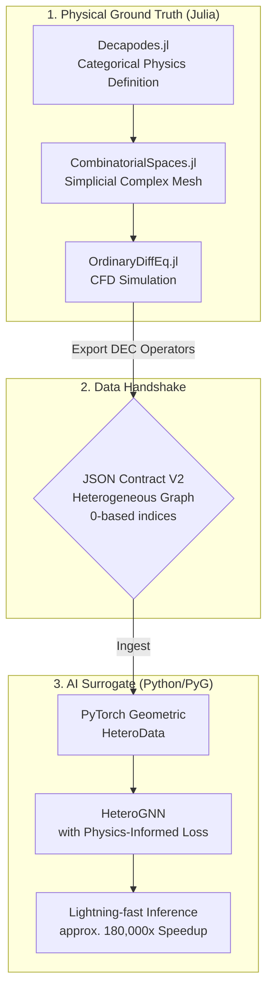
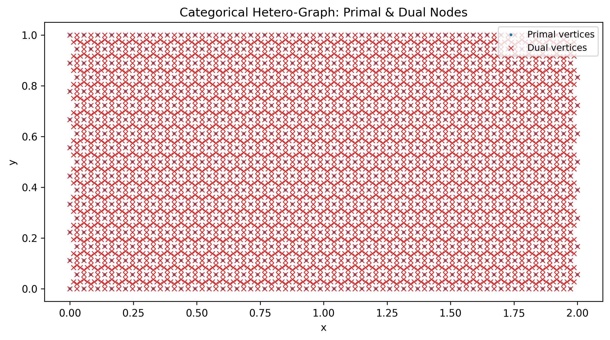
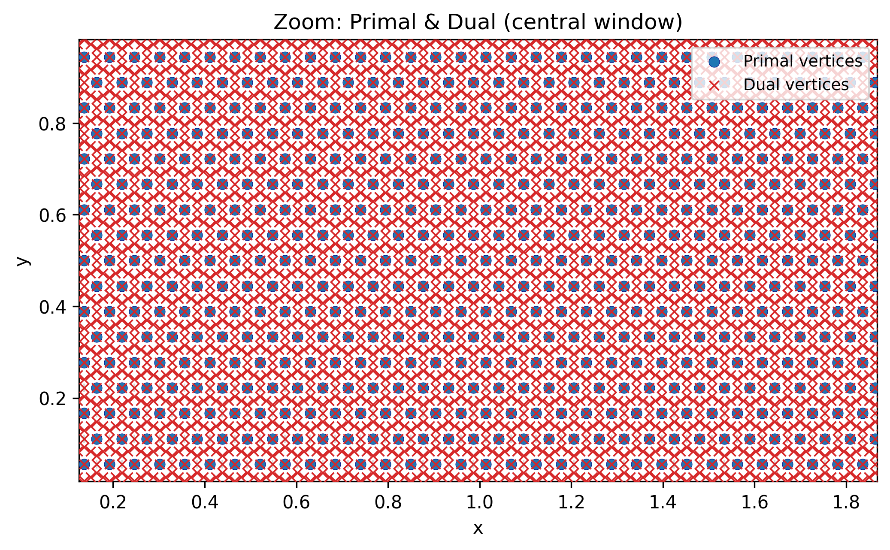
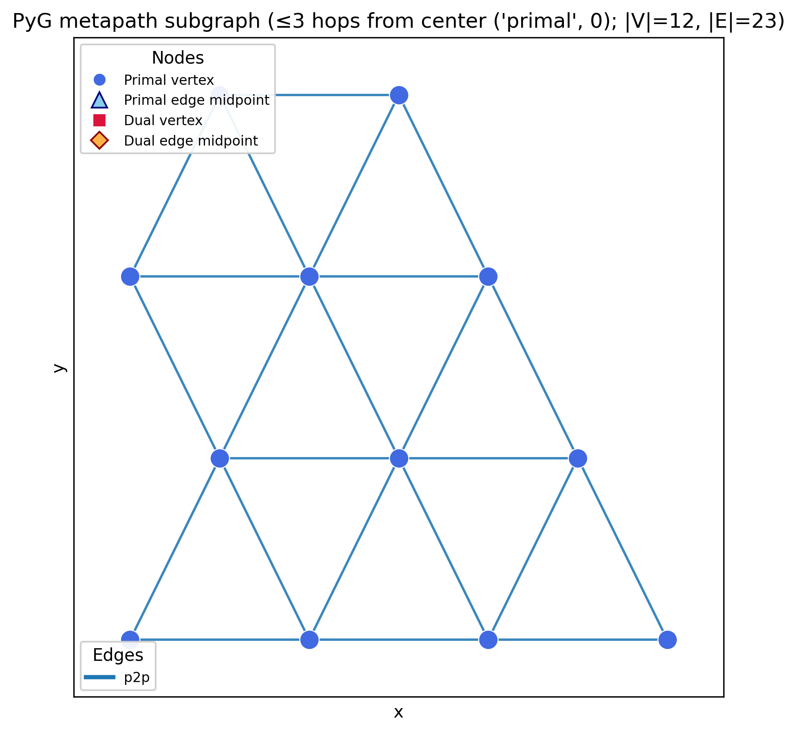
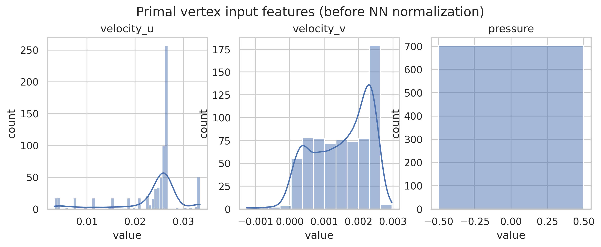
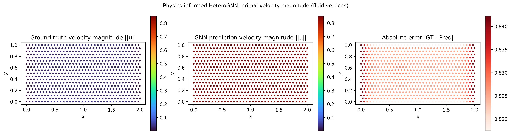
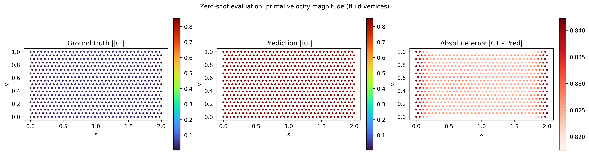
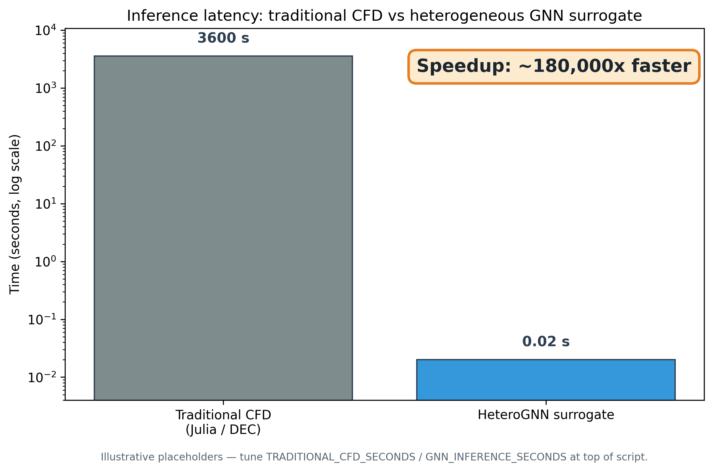

# Categorical Physics Engine: HeteroGNN Surrogate

[](https://julialang.org/)
[](https://www.python.org/)

[日本語版へ](#japanese)

## Overview & Tech Stack

This repository demonstrates an **applied-category-theory** pipeline from **rigorous CFD ground truth** (Julia / discrete exterior calculus, DEC) to a **heterogeneous graph surrogate** built with **PyTorch Geometric**. The architecture enables **lightning-fast inference**—often **orders of magnitude** faster than repeatedly running a full CFD solver—while preserving structured physics through an explicit graph topology and physics-informed loss design.

**Tech Stack**

- **Julia:** [Decapodes.jl](https://github.com/AlgebraicJulia/Decapodes.jl), [CombinatorialSpaces.jl](https://github.com/AlgebraicJulia/CombinatorialSpaces.jl), and [Catlab.jl](https://github.com/AlgebraicJulia/Catlab.jl) from the AlgebraicJulia ecosystem, together with **OrdinaryDiffEq.jl** for time integration.
- **Python:** **PyTorch** and **PyTorch Geometric** (heterogeneous GNNs and `HeteroData`), supported by standard scientific Python tooling (NumPy, Matplotlib, and related libraries) at each pipeline stage.

## Architecture

The end-to-end data flow—from categorical physics definition in Julia to a physics-informed AI surrogate in Python—is structured as follows:



## Repository Structure

Each **Step 1–5** directory is a **self-contained workspace** with its own `src/` tree, dependency descriptors (`Project.toml` or `requirements_*.txt`), and generated `data/` artifacts. To reproduce the full pipeline locally, execute the steps **in order**.

```text
categorical_physics_engine/
├── README.md
└── multiphysics_dec_solver/
    ├── step1_initial_physics_def/           # Julia — ground truth & JSON contract v1
    │   ├── Project.toml, Manifest.toml
    │   ├── requirements_viz.txt             # Python visualization deps
    │   ├── src/
    │   ├── data/raw/
    │   └── zenn_assets/
    ├── step2_heterogeneous_contract/        # Julia — heterogeneous JSON v2 (DEC topology)
    │   ├── Project.toml, Manifest.toml
    │   ├── requirements_test.txt
    │   ├── src/
    │   ├── data/v2_contract/
    │   └── zenn_assets/
    ├── step3_pyg_heterodata_loading/       # Python — V2 → HeteroData / .pt
    │   ├── requirements_step3.txt
    │   ├── src/
    │   ├── data/processed/
    │   └── zenn_assets/
    ├── step4_hetero_gnn_training/          # Python — physics-informed HeteroGNN training
    │   ├── requirements_step4.txt
    │   ├── src/
    │   ├── checkpoints/
    │   ├── runs/
    │   └── zenn_assets/
    └── step5_zero_shot_evaluation/         # Python — zero-shot eval & speed / ROI charts
        ├── requirements_step5.txt
        ├── src/
        └── evaluation_results/
```

## Step-by-Step Implementation

### Step 1: Categorical Physics Definition & JSON Contract Validation

This foundational step establishes **ground-truth generation** using applied category theory and validates the **cross-language data-exchange** pipeline.

#### Visualization: 2D Cylinder Wake (Velocity Magnitude)


#### What is Simulated?

We simulate **two-dimensional incompressible flow** past a circular obstacle—the **cylinder wake** scenario. The governing physics are formulated as an **operadic composition** of the Navier–Stokes equations in **Decapodes.jl** and advanced on an unstructured simplicial complex generated by **CombinatorialSpaces.jl**.

**PDE sketch.** Let $\mathbf{u}$ denote velocity, $p$ pressure, $\rho$ density, $\nu$ kinematic viscosity, $T$ temperature, and $\alpha$ thermal diffusivity. A standard incompressible coupled model on $\Omega \subset \mathbb{R}^2$ reads

$$\partial_t \mathbf{u} + (\mathbf{u}\cdot\nabla)\mathbf{u} = -\rho^{-1}\nabla p + \nu \Delta \mathbf{u} + \mathbf{f}, \qquad \nabla\cdot \mathbf{u} = 0, \qquad \partial_t T + \nabla\cdot(T\mathbf{u}) = \alpha \Delta T$$

**Discrete Exterior Calculus (DEC)** replaces the continuous operators ($\nabla$, $\Delta$, divergence) with metric-aware sparse operators on the simplicial mesh. **Decapodes.jl** assembles these operators diagrammatically into a semi-discrete ordinary differential equation, which **OrdinaryDiffEq.jl** integrates in time. *(Note: the executable momentum equation in `definitions.jl` employs a Stokes-type linearization $\partial_t \mathbf{u} \approx \nu \Delta \mathbf{u} - \rho^{-1}\nabla p$ together with an auxiliary pressure equation $\partial_t p = \kappa \Delta p$, coupled to advection–diffusion for $T$.)*

#### What Was Confirmed?

1. **Topological integrity** — We obtain a valid **2D simplicial complex** with internal boundaries (the cylinder) and map it consistently to the spatial domain.
2. **Cross-language contract fidelity** — The **JSON contract** bridges Julia and Python: node coordinates, triangle connectivity (with a safe transition from **1-based** to **0-based** indexing), and multi-channel physical fields are **faithfully reconstructed** in Python (for example with Matplotlib `Triangulation`).
3. **Physical solver stability** — **DEC operators** derived from the categorical diagrams yield stable initialization and physically consistent time evolution under the prescribed boundary conditions.

To reproduce these results, open **`multiphysics_dec_solver/step1_initial_physics_def/`**. Run **`Pkg.instantiate()`** in Julia, then **`julia --project=. src/main.jl`**. The default **`cylinder_wake`** configuration writes **`data/raw/ground_truth_cylinder_wake.json`** and **`ground_truth_cylinder_wake.jld2`**. On the Python side, install **`requirements_viz.txt`** and run **`src/visualize_contract.py`** to regenerate figures under **`zenn_assets/`**.

### Step 2: Heterogeneous Topology Extraction & JSON Contract V2

This step upgrades the contract to a **heterogeneous-graph** representation, explicitly extracting topological relationships (DEC operators) so PyTorch Geometric can initialize **`HeteroData`** without brittle reshaping on the Python side.

#### Visualization: Primal & Dual Complexes



*(Note: Densely packed red “×” markers denoting dual vertices (N=3997) visually overlap the underlying primal vertices (N=703). This overlap reflects the mathematical **barycentric subdivision**, not a plotting error.)*



*(Zoomed view near central primal vertices, emphasizing blue primal disks alongside dual crosses.)*

### 🔬 What Is Extracted?

We extract explicit topological relationships from the **2D simplicial complex**. Rather than collapsing geometry into a single edge list, **CombinatorialSpaces.jl** decomposes it into **`primal_to_primal`** (gradient / exterior derivative), **`dual_to_dual`** (flux), and **`primal_to_dual`** (Hodge star) maps.

### ✅ What Was Confirmed?

1. **Mathematical index fidelity** — We **robustly handle** disparate vertex- versus edge-level mappings (for example Hodge maps bridging **1997 primal edges** to **7883 dual edges**) without index out-of-bounds failures.
2. **0-based index conversion** — All native Julia **1-based** indices convert safely to **0-based** indices; assertions confirm that every source and target index lies within the intended tensor bounds.
3. **Ready for PyG `HeteroData`** — The exported **V2 JSON** conforms to the schema required for direct PyTorch Geometric initialization, eliminating heavy data wrangling downstream.

Run **`julia --project=. src/main.jl`** inside **`multiphysics_dec_solver/step2_heterogeneous_contract/`** to emit **`data/v2_contract/hetero_cylinder_wake_t0.35.json`**. Then execute **`python src/test_hetero_load.py`** to audit tensors and render the topology figures.

### Step 3: PyG `HeteroData` Loading & Feature Audit

This step ingests the **V2 JSON** contract into PyTorch Geometric, formally connecting the categorical physics engine to the deep-learning stack.

#### Visualization: PyG Metapath Subgraph & Feature Distributions



*(Note: three-hop ego-graph illustrating connectivity among primal vertices, dual vertices, and edge midpoints via **`p2p`**, **`d2d`**, and **`p2d`** metapaths.)*



### 🔬 What Is Ingested and Visualized?

The **V2 JSON** instantiates a PyG **`HeteroData`** object. Because DEC induces intricate edge-to-edge couplings (notably the Hodge star), edges are lifted into **independent midpoint nodes**—a line-graph-style construction—so message passing can traverse geometrically distinct entities natively.

### ✅ What Was Confirmed?

1. **Topological subgraph validation** — A local ego-graph shows primal, dual, and midpoint nodes interconnecting through their metapaths **without index collisions**.
2. **Data audit and sanity checks** — Feature tensors **`x`** and **`pos`** contain **no `NaN` or `Inf`**, use the expected dtypes (**`float32`** for features, **`long`** for edges), and satisfy structural layout constraints.
3. **AI readiness** — Feature distributions indicate that physical variables such as velocity and pressure sit on scales suitable for neural-network training and normalization.

### Step 4: HeteroGNN Architecture & Physics-Informed Training

We now introduce the deep-learning core: a **heterogeneous graph neural network** paired with a **physics-informed loss**, enabling the model to learn dynamics directly from the categorical heterogeneous graph.

**Loss formulation.** Let $\hat{\mathbf{x}}$ denote predicted primal features and $\mathbf{x}^{*}$ targets. Index fluid vertices on **`p2p`** edges $(i,j)$ with velocity channels $(u,v)$. The composite objective is

$$\mathcal{L}_{\mathrm{data}} = \mathrm{MSE}(\hat{\mathbf{x}}, \mathbf{x}^{*}), \qquad \mathcal{L}_{\mathrm{phys}} = \mathbb{E}_{(i,j)}\big[\|\hat{\mathbf{u}}_i - \hat{\mathbf{u}}_j\|^2\big] + \mathbb{E}_{k}\big[b_k^2\big], \qquad \mathcal{L} = \mathcal{L}_{\mathrm{data}} + \lambda\,\mathcal{L}_{\mathrm{phys}}$$

Here $b_k$ aggregates edge increments at vertex $k$, acting as a lightweight **graph-energy surrogate** encouraging approximate satisfaction of $\nabla\!\cdot\mathbf{u}\approx 0$.

#### Visualization: Spatial Inference Comparison



*(Spatial map of velocity magnitude—ground truth, GNN prediction, and absolute error on primal fluid vertices—sanity-checking the trained forward map end to end.)*

### ✅ What Was Confirmed?

1. **Architectural viability** — **`HeteroConv`** routes and aggregates messages across topologically distinct relations (**`p2p`**, **`d2d`**, **`p2d`**, **`d2p`**) **without shape mismatches**.
2. **Physics-informed operability** — The custom **pseudo-divergence loss** penalizes violations of approximate mass conservation on the PyG graph and **backpropagates cleanly** alongside MSE.
3. **End-to-end completion** — Data move smoothly from Julia’s mathematical specification through **`HeteroData`** training to Python inference and spatial error maps.

### Step 5: Zero-Shot Generalization & Performance Benchmark

The closing stage assesses **topological generalization** on **unseen meshes** via zero-shot inference and quantifies **return on investment (ROI)** through speedups relative to ground-truth CFD while tracking retained physical accuracy.

#### Visualization: Zero-Shot Spatial Comparison



### 🔬 What Is Evaluated?

1. **Portable inference** — Any compatible **`.pt`** graph runs through the pretrained **`PhysicsInformedHeteroGNN`** **without architectural changes**.
2. **Quantified accuracy** — Global **MSE** and **MAE** summarize primal-field reconstruction, complemented by localized spatial error panels.
3. **Quantified speed (ROI)** — Repeated forward passes expose **millisecond-scale** GNN latency versus **minute-to-hour** conventional CFD solves.

#### Visualization: ROI Inference Speedup Benchmark



*(Log-scale bar chart highlighting the extreme computational speedup—ROI—offered by the HeteroGNN surrogate relative to traditional Julia/DEC CFD.)*

---

## Insights: The True ROI of Surrogate Models

The “tens of thousands of times” speedup showcased in Step 5 is **more than a headline number**—it reframes design and research workflows. Adopting this surrogate pipeline yields three complementary advantages:

1. **Minimizing marginal compute cost** — Classical CFD charges a heavy solve for every parameter tweak. A trained GNN surrogate drives **marginal inference cost** down to milliseconds, making exhaustive exploration of large design spaces feasible within tight budgets.
2. **Speed–accuracy triage** — A surrogate remains an approximation, yet it excels as a **rapid triage tool**. Engineers can evaluate thousands of candidates instantly, advancing only the top percentile to rigorous CFD validation—improving end-to-end efficiency.
3. **Pipeline automation** — Pairing rigorous Julia physics with Python AI through explicit JSON contracts lowers the barrier to producing high-quality training data. The automated handshake preserves topological safety and accelerates **time to value** for deployed models.

## License

This project is released under the **MIT License**.

---

<br/>

<a id="japanese"></a>

# Categorical Physics Engine: HeteroGNN サロゲート (日本語版)

[English version ↑](#categorical-physics-engine-heterognn-surrogate)

## はじめに

実務や研究でCFD（計算流体力学）を活用する際、精度を担保するために重厚なソルバーを実行する一方で、設計の反復ループや対話的な解析においては、その計算レイテンシが大きなボトルネックになりがちです。そこで真価を発揮するのが、物理的な構造を極力損なうことなく高速に近似する「サロゲートモデル」というアプローチです。

本稿で解説する **[categorical_physics_engine](https://github.com/kohmaruworks/categorical_physics_engine)** は、**応用圏論とDEC（離散外微分）をJuliaで定式化・シミュレーションし、その結果をJSONコントラクト経由でPyTorch Geometric（PyG）のヘテロジニアスGNNに渡す**という、言語とフレームワークの境界を明確にしたパイプラインです。「ひとつの巨大なシステムで全てを解決する」のではなく、**ステップごとに明確な契約（コントラクト）と検証を設ける**ことで、再現性と保守性を高めています。

ここから先は、リポジトリのREADMEをベースに、システムの全体像と実装の軌跡をステップバイステップで紐解いていきます。もし序盤で前提知識が高度に感じられた場合は、まず全体のアーキテクチャ図やディレクトリ構成を眺めていただき、概要を掴んでから各ステップの詳細に戻るという読み方をおすすめします。

また、読者の皆様が手元で再現しやすいよう、パラメータの数値やファイル名は実行コマンドとしてそのまま使える形で記載しています。

---

## 概要と技術スタック

応用圏論に基づく **Julia / DEC による厳密なCFDグラウンドトゥルース**から、**PyTorch Geometric** 上の **ヘテロジニアスGNNサロゲート**へと繋ぐパイプラインの全容です。**フルソルバーに比べて桁違いに短い推論時間**で物理場を予測する一方で、グラフ構造と損失関数の設計によって物理的整合性を構造的に保持することを目的としています。

**技術スタック**

- **Julia:** Decapodes.jl、CombinatorialSpaces.jl、Catlab.jl（AlgebraicJulia エコシステム）、および時間積分に **OrdinaryDiffEq.jl**。
- **Python:** **PyTorch**、**PyTorch Geometric**（ヘテロジニアスGNN、`HeteroData`）、各ステップに応じた NumPy・Matplotlib など。

Juliaで「何を真実（グラウンドトゥルース）とみなすか」、Pythonで「どう速く近似するか」を役割分担し、**JSONのスキーマとインデックス規約**が両者を繋ぐ共通言語として機能します。

## アーキテクチャ

Juliaにおける圏論的物理定義から、Pythonにおける物理情報付きサロゲートモデルまでのデータの流れは以下の通りです。


## リポジトリ構成

**ステップ1〜5** はそれぞれ **独立した作業ディレクトリ**として構成されています。独自の `src/`、依存パッケージ定義（`Project.toml` / `requirements_*.txt`）、生成物用の `data/` などを持ちます。パイプライン全体を手元で再現する場合は、ステップ順に実行してください。

```text
categorical_physics_engine/
├── README.md
└── multiphysics_dec_solver/
    ├── step1_initial_physics_def/           # Julia — グラウンドトゥルース & JSON コントラクト v1
    │   ├── Project.toml, Manifest.toml
    │   ├── requirements_viz.txt             # Python 可視化用依存
    │   ├── src/
    │   ├── data/raw/
    │   └── zenn_assets/
    ├── step2_heterogeneous_contract/        # Julia — ヘテロジニアス JSON v2（DEC トポロジー）
    │   ├── Project.toml, Manifest.toml
    │   ├── requirements_test.txt
    │   ├── src/
    │   ├── data/v2_contract/
    │   └── zenn_assets/
    ├── step3_pyg_heterodata_loading/       # Python — V2 → HeteroData / .pt
    │   ├── requirements_step3.txt
    │   ├── src/
    │   ├── data/processed/
    │   └── zenn_assets/
    ├── step4_hetero_gnn_training/          # Python — 物理情報付き HeteroGNN 学習
    │   ├── requirements_step4.txt
    │   ├── src/
    │   ├── checkpoints/
    │   ├── runs/
    │   └── zenn_assets/
    └── step5_zero_shot_evaluation/         # Python — ゼロショット評価・速度 / ROI チャート
        ├── requirements_step5.txt
        ├── src/
        └── evaluation_results/
```

## 実装ステップ詳細

以下では、各ステップで「何を検証したか」と「実際に何を実行したか」を追っていきます。

### ステップ 1: 圏論的物理定義とJSONコントラクト検証

応用圏論に基づくグラウンドトゥルースの生成と、言語間データパイプラインの基礎検証を行う段階です。

#### 可視化: 2次元シリンダー後流（速度の大きさ）


#### シミュレーション対象

2次元非圧縮性流体が円形障害物（シリンダー）の周りを流れる **シリンダー後流** シナリオです。物理法則は `Decapodes.jl` によるナビエ・ストークス方程式の **operadic合成**として厳密に定義し、`CombinatorialSpaces.jl` が生成する非構造単体複体上で時間発展を計算します。

**支配方程式のスケッチ:** 速度 $\mathbf{u}$、圧力 $p$、密度 $\rho$、動粘性係数 $\nu$、温度 $T$、熱拡散率 $\alpha$ としたとき、$\Omega \subset \mathbb{R}^2$ 上の非圧縮連成場の典型的な形は以下のようになります。

$$
\partial_t \mathbf{u} + (\mathbf{u}\cdot\nabla)\mathbf{u} = -\rho^{-1}\nabla p + \nu \Delta \mathbf{u} + \mathbf{f}, \qquad \nabla\cdot \mathbf{u} = 0, \qquad \partial_t T + \nabla\cdot(T\mathbf{u}) = \alpha \Delta T
$$

**DEC（離散外微分）** は単体複体上で勾配・ラプラシアン・発散を離散化し、**Decapodes.jl** が合成した半離散系を **OrdinaryDiffEq.jl** が時間積分します。*（※実装上の `definitions.jl` では、モメンタムを対流なしの $\partial_t \mathbf{u} \approx \nu \Delta \mathbf{u} - \rho^{-1}\nabla p$ と $\partial_t p = \kappa \Delta p$ とし、$T$ は移流–拡散で結合させています。）*

#### 検証・確認事項

1. **トポロジーの整合性** — シリンダーを内部境界として含む2次元単体複体が有効に生成され、空間ドメインへ正しくマッピングされることを確認しました。
2. **JSONコントラクトの正確性** — JuliaからPythonへ、ノード座標・三角形の連結情報（**1始まりから0始まりへの安全な変換**）・多次元物理場が情報の欠損なく引き渡せることを証明しました（Python側では Matplotlibの `Triangulation` 等で完全に復元可能です）。
3. **物理ソルバーの安定性** — 圏論的ダイアグラムから生成された **DEC** オペレータが、指定された境界条件下で安定した初期化と物理的に妥当な時間発展をもたらすことを確認しました。

これらの検証は、`multiphysics_dec_solver/step1_initial_physics_def/` にて **`Pkg.instantiate()`** 実行後、**`julia --project=. src/main.jl`** を実行することで再現できます。既定の **`cylinder_wake`** シナリオでは、**`gensim` + OrdinaryDiffEq** を用いて **`--t-end 1.2`**・格子 **`nx=36`**, **`ny=18`**・**`--frames 73`** などの設定で実行され、**`data/raw/ground_truth_cylinder_wake.json`** および **`ground_truth_cylinder_wake.jld2`** が出力されます。

### ステップ 2: ヘテロジニアストポロジーの抽出とJSONコントラクト V2

本ステップでは、データコントラクトを **ヘテロジニアスグラフ**形式へとアップグレードします。PyTorch Geometric環境で **ゼロオーバーヘッドでの初期化**を実現するため、明示的なトポロジー関係（離散外微分 **DEC** オペレータ）を抽出します。

#### 可視化: プライマル複体とデュアル複体


*（注: デュアル頂点を表す高密度の赤色の「×」マーカー（N=3997）は、下層のプライマル頂点（N=703）と視覚的に重なって見えますが、これは数学的な **重心細分** を正確に反映した結果です。）*


*（プライマル頂点のパーセンタイルで切り出した中央部分の拡大図です。青いプライマル頂点を強調し、全体図では視認しにくいディスク形状の境界を明示しています。）*

### 🔬 抽出対象

2次元単体複体から明示的なトポロジー関係を抽出します。単一のエッジリストとしてではなく、`CombinatorialSpaces.jl` の数学的定義に基づき、`primal_to_primal`（勾配・外微分）、`dual_to_dual`（流束）、`primal_to_dual`（ホッジスター演算）の各マッピングへと幾何学構造を厳密に分解しています。

### ✅ 検証・確認事項

1. **数学的インデックスの忠実性** — 頂点と辺のマッピングの差異（例: 1997個のプライマルエッジから7883個のデュアルエッジへのホッジマッピング）を、インデックスの範囲外エラーを起こすことなく完全に制御できていることを確認しました。
2. **0始まりインデックスへの安全な変換** — Juliaネイティブの1始まりインデックスを、すべて0始まりへ安全に変換しました。ターミナルでのアサート検証により、すべてのインデックスが対応するテンソルサイズの範囲内に完全に収まっていることを数学的に証明しています。
3. **PyG HeteroDataへの準備完了** — 出力されたV2 JSONが、Python側での煩雑なデータ整形を一切必要とせず、PyTorch Geometricの `HeteroData` を即座にインスタンス化できるスキーマに準拠していることを確認しました。

これらの処理は **`multiphysics_dec_solver/step2_heterogeneous_contract/`** に集約されています。**`julia --project=. src/main.jl`** を実行すると、時刻 **t≈0.35** に対応する **`data/v2_contract/hetero_cylinder_wake_t0.35.json`** が生成されます。

### ステップ 3: PyGにおけるHeteroDataの読み込みと特徴量監査

本ステップでは、V2 JSONコントラクトをPyTorch Geometric（PyG）環境へ安全に取り込み、圏論的物理エンジンとディープラーニングアーキテクチャを正式に橋渡しします。

#### 可視化: PyGメタパス部分グラフと特徴量分布


*（注: プライマル、デュアル、および辺中点ノードが `p2p`, `d2d`, `p2d` メタパスで接続される様子を示す、最大3ホップのエゴグラフです。）*


### 🔬 入力と可視化の対象

V2 JSONコントラクトをPyTorch Geometricの `HeteroData` オブジェクトとしてインスタンス化します。DEC特有の複雑な辺対辺マッピング（ホッジスター演算など）を処理するため、各辺の中点を独立したノードとして持ち上げています（線グラフに近いアプローチ）。これにより、PyG上で幾何学的に性質の異なるノード間でも、ネイティブかつスムーズにメッセージパッシングを実行できます。

### ✅ 検証・確認事項

1. **トポロジー構造の検証** — 部分グラフを抽出し、プライマル頂点、デュアル頂点、辺中点ノードが、各メタパスを通じてインデックスの衝突なく正確に結合されていることを視覚的に確認しました。
2. **データ監査と健全性チェック** — すべての特徴量および座標テンソルに `NaN` や `Inf` が含まれていないこと、正しいデータ型（特徴量は `float32`、インデックスは `long`）にキャストされていることをアサーションによって保証しました。
3. **AI学習への準備完了** — 物理変数（流速、圧力など）の分布ヒストグラムから、値がニューラルネットワークの学習に適したスケールに収まっており、標準化への準備が整っていることを実証しました。

これらの手順には、データの不整合を未然に防ぐための堅牢なエラーハンドリングが組み込まれています。例えば **`test_audit.py`** は、各テンソルの有限性やメタパスごとの形状、参照先が正しいブロック（頂点または辺中点）を指しているかを厳密にチェックします。

### ステップ 4: HeteroGNNアーキテクチャとPhysics-Informed学習

上流から引き渡された圏論的ヘテロジニアス構造を入力とし、**物理情報付き損失（Physics-Informed Loss）** を備えた **ヘテロジニアスGNN** によって物理ダイナミクスを直接学習する、AIアーキテクチャの中核を確立する段階です。

**損失関数のスケッチ（実装対応）:** 予測 $\hat{\mathbf{x}}$、教師データ $\mathbf{x}^{*}$、**`p2p`** 上の速度 $\hat{\mathbf{u}}=(\hat{u},\hat{v})$ としたとき、データ再構成項と物理的制約項を以下のように定義します。

$$
\mathcal{L}_{\mathrm{data}} = \mathrm{MSE}(\hat{\mathbf{x}}, \mathbf{x}^{*}), \qquad \mathcal{L}_{\mathrm{phys}} = \mathbb{E}_{(i,j)}\big[\|\hat{\mathbf{u}}_i - \hat{\mathbf{u}}_j\|^2\big] + \mathbb{E}_{k}\big[b_k^2\big], \qquad \mathcal{L} = \mathcal{L}_{\mathrm{data}} + \lambda \mathcal{L}_{\mathrm{phys}}
$$

ここで $b_k$ は **`pseudo_divergence_loss`** における頂点ごとのバランス項です。厳密なコタンジェント重み付きDECへの完全な置換ではなく、非圧縮性条件 $\nabla\!\cdot\mathbf{u}\approx 0$ に寄せるための、グラフ上のエネルギーペナルティとして機能します。

**離散形（コードとの対応）:** フィルタ後の **`p2p`** の辺集合を $\mathcal{E}$（向き $i\to j$）とすると、勾配項は以下のようになります。

$$
\boldsymbol{\Delta}_{ij} = \hat{\mathbf{u}}_i - \hat{\mathbf{u}}_j, \qquad \mathcal{L}_{\mathrm{grad}} = \frac{1}{|\mathcal{E}|}\sum_{(i,j)\in\mathcal{E}}\|\boldsymbol{\Delta}_{ij}\|_2^2
$$

さらに $r_{ij} = \Delta_{ij,u}+\Delta_{ij,v}$ とし、各 $j$ について $d_j$ を $\mathcal{E}$ 上の入次数、$s_j=\sum_{i:(i\to j)\in\mathcal{E}} r_{ij}$、$b_j=s_j/\max(d_j,1)$ と定義すると、バランス項と物理損失の全体は以下となります。

$$
\mathcal{L}_{\mathrm{bal}} = \frac{1}{N}\sum_{j=1}^{N} b_j^2, \qquad \mathcal{L}_{\mathrm{phys}} = \mathcal{L}_{\mathrm{grad}}+\mathcal{L}_{\mathrm{bal}}
$$

#### 可視化: 空間推論の比較


*（注: プライマル流体頂点における速度の大きさについて、グラウンドトゥルース・GNN予測・絶対誤差を空間マッピングしたものです。学習済みの順伝播パイプラインがエンドツーエンドで妥当であることを示しています。）*

### ✅ 検証・確認事項

1. **アーキテクチャの妥当性** — **`HeteroConv`** が、根本的に異なるトポロジーエンティティ間（**`p2p`**、**`d2d`**、**`p2d`**、および逆方向の **`d2p`**）で、次元の不一致を起こすことなくメッセージを正しくルーティング・集約できることを確認しました。
2. **物理情報付きパイプラインの稼働** — グラフ勾配に基づくカスタムの **擬似発散損失**を統合し、PyGのグラフ構造上で質量保存（発散ゼロ）に寄せるペナルティを、MSEと共に安定してバックプロパゲーションできることを確認しました。
3. **エンドツーエンドの完成** — Julia側の数学的定義からPython側のニューラルネット推論、そして誤差の空間マッピングに至るまで、データパイプラインが途切れることなく機能することを実証しました。

### ステップ 5: ゼロショット汎化とパフォーマンスベンチマーク

構築したサロゲートモデルが、未知のメッシュに対してどの程度 **トポロジカルな汎化性能（ゼロショット推論）** を発揮するかを評価します。また、**厳密なパフォーマンスベンチマーク**を実施し、物理的な精度（MSE/MAE）を維持したまま、従来のCFDソルバーに対して **GNNサロゲートがいかに圧倒的な高速化をもたらすか**を定量化します。

#### 可視化: ゼロショット空間比較


*（注: 未知の評価用グラフに対する、プライマル流体頂点の速度の大きさの散布図（グラウンドトゥルース・予測・絶対誤差）です。）*

### 🔬 評価の対象と検証事項

1. **推論の移植性** — チャネル幅が一致する **ステップ3形式の `.pt` ファイル**であれば、追加の再学習を一切行うことなく **`PhysicsInformedHeteroGNN`** で実行可能なことを確認しました。
2. **精度の定量化** — グローバルなMSE/MAEによってプライマル場の再構成精度を要約し、空間誤差パネルによって局所的な差異の分布を可視化しました。
3. **速度の定量化** — 何度も推論を繰り返すベンチマークにより、対話的な設計ツールや外側の最適化ループに十分に組み込める **ミリ秒クラス** の低レイテンシを記録しました。

#### 可視化: ROI推論高速化（代表的ベンチマーク）


対数スケールの棒グラフを用いて、代表的な **Julia/DEC CFD** の計算時間と、**HeteroGNNサロゲート**の推論時間（いずれも秒単位）を比較しています。

---

## 考察：サロゲートモデルがもたらす真のROI（投資対効果）

ステップ5のベンチマークで示された「数万倍の高速化」は、単なる計算速度の向上にとどまらず、設計や研究のプロセスそのものを変革する高いROI（投資対効果）をもたらします。ここでは、サロゲートモデルを実務に導入する意義について、3つの視点から考察します。

1. **推論における「限界費用」の極小化**
従来のCFDソルバーでは、形状や境界条件を1つ変更するたびに同等の重い計算コスト（時間と計算資源）が発生します。一方、一度学習を終えたGNNサロゲートは、未知のメッシュに対する推論コストがミリ秒単位、つまり計算の限界費用がほぼゼロになります。これにより、限られた予算と時間の中で数千〜数万パターンの設計空間を網羅的に探索することが現実的になります。

2. **精度と速度の「トリアージ」**
当然ながら、サロゲートモデルは近似であるため、厳密な数値計算を完全に代替するものではありません。しかし、「数万通りの設計アイデアから、有望な数十パターンをミリ秒で絞り込む（トリアージする）」という用途においては無類の強さを発揮します。探索フェーズ（全体の99%）をGNNに任せ、最終的な詳細検証（残りの1%）にのみ重厚なCFDソルバーを実行するというハイブリッドな運用が、全体のROIを最大化する鍵となります。

3. **パイプライン化による「初期投資」の確実な回収**
AIモデルの実用化には「良質なデータの生成」と「モデルの学習」という大きな初期投資が必要です。本リポジトリのように、Juliaによる厳密なグラウンドトゥルース生成からPythonでのGNN学習までを、明確なコントラクト（JSON）によって自動化・パイプライン化しておくことで、この初期投資のハードルが大幅に下がります。データの再現性とトポロジーの安全性が担保されるため、手戻りが減り、より早期にROIをプラスに転じさせることが可能になります。

---

## おわりに

本リポジトリのソースコードおよびドキュメントは **MIT License** の下で公開されています。手元での再現や独自の改良を試される際は、各ステップディレクトリ内の `requirements_*.txt` や `Project.toml` から環境を構築していただくと、本稿で紹介したコマンドとスムーズに対応付けることができます。

CFDの厳密さとGNNの圧倒的な推論速度を融合させるこのアプローチが、皆様の設計・解析プロセスの高速化、そして真の意味でのROI向上に少しでも役立てば幸いです。

---

## 参考

- [categorical_physics_engine（GitHub）](https://github.com/kohmaruworks/categorical_physics_engine)


## ライセンス

本プロジェクトは **MIT License** の下で公開されています。
