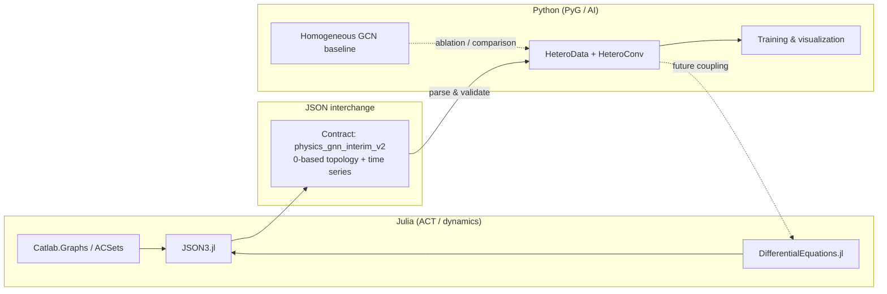

# Physics-Informed HeteroGNN Surrogate

[English](#english) | [日本語](#japanese)

[](https://julialang.org/)
[](https://www.python.org/)
[](https://pytorch-geometric.readthedocs.io/)

---

<h2 id="english">English Version</h2>

### Overview & Architecture

This repository provides a reproducible surrogate pipeline for **multiphysics CFD**: **Discrete Exterior Calculus (DEC)**–aware **Primal and Dual complexes** are exported from **Julia** and consumed by **heterogeneous graph neural networks (HeteroGNNs)** in **Python** with **PyTorch Geometric** (`HeteroConv`, `SAGEConv`). The aim is to preserve mesh-native topological priors—rather than collapsing dynamics into a single homogeneous graph—and to amortize forward solves with neural rollouts suited to research and engineering iteration.

Architecturally, we enforce a **strict JSON contract** across runtimes, **1-based → 0-based index normalization** at the export seam, and **compositionality-oriented** module boundaries for future multiphysics extensions.

The figure below is a **conceptual** dataflow (stack names reflect the intended categorical / dynamics tooling; see **`src/julia/Project.toml`** for the exact pinned Julia packages used in this snapshot).



- **Solid arrows:** today's batch pipeline — Julia exports **JSON**, Python builds **`HeteroData`** and runs **training / autoregressive inference / plotting**.
- **Dashed «future coupling»:** optional tighter integration (e.g., co-simulation or in-process bridging); **not** required for reproducibility of the JSON-first workflow shipped here.

Large artefacts under **`data/interim/`** (JSON, checkpoints, rollouts, figures) are typically **ignored by Git** — reproduce them locally with the **Quick Start** commands below rather than committing binaries.

### Key Features

- **Language boundary.** Julia retains **physics modeling and discrete simulation exports**; Python retains **representation learning, training, autoregressive rollout, and visualization**. Stacks meet only via the versioned **`physics_gnn_interim_v2`** **JSON Contract**, eliminating implicit in-process coupling.

- **Index safety.** **1-based** Julia arrays are reconciled with **0-based** PyTorch/NumPy **once**, at **`utils_export.jl`**, with consistent COO layout for **`edge_index`** — guarding against silent **Primal–Dual topology drift** across the FFI-style boundary.

- **Modularity & compositionality.** Separate modules for mesh/discretization, export, PyG ingestion, optimization, rollout, and plotting mirror **compositionality** expectations from applied category theory, so discrete physics backends or DSLs can evolve **without rewriting the full surrogate stack.**

Additional technical notes: **HeteroGNN** message passing spans **Primal**, **Dual**, and **`primal_to_dual`** relations; a **physics-informed** term **approximates divergence-free constraints via cell-wise flux aggregation** (primal velocities **`scatter_add`–pooled to dual cells**) as a loose surrogate for \(\nabla \cdot \mathbf{v} = 0\), not a DEC-exact discrete Hodge formulation.

### Quick Start (Usage)

Run from the **repository root**. Interim JSON and other bulky outputs live under **`data/interim/`** and are **excluded from version control** (see **`.gitignore`**) — **regenerate** them with these steps.

**1 · Generate interim JSON (Julia ≥ 1.9)** — details in **[docs/julia_setup.md](docs/julia_setup.md)**.

```bash
julia --project=src/julia -e 'using Pkg; Pkg.instantiate()'
julia --project=src/julia src/julia/03_simulation.jl
```

Writes **`data/interim/v2_step1_ground_truth_toy.json`** with schema **`physics_gnn_interim_v2`**.

**2 · Train (Python ≥ 3.10)**

```bash
python3 -m venv .venv
source .venv/bin/activate   # Windows: .venv\Scripts\activate
pip install -r requirements.txt
python src/python/train.py   # → data/interim/hetero_gnn_model.pth
```

Example: `python src/python/train.py --epochs 50 --history-len 1 --lambda-phys 0.1`  
With **[uv](https://docs.astral.sh/uv/)**: `uv venv .venv && source .venv/bin/activate && uv pip install -r requirements.txt`

**3 · Autoregressive inference + visualization**

```bash
python src/python/inference.py
python src/python/visualize.py --animate
```

Optional: **`source scripts/setup_env.sh`** · Docker: `docker build -t hetero-surrogate-julia .` then `docker run --rm -v "$PWD":/app -w /app hetero-surrogate-julia`

### License

Released under the **MIT License** — see **[LICENSE](LICENSE)**.

---

<h2 id="japanese">日本語版 (Japanese Version)</h2>

### 概要とアーキテクチャ（Overview & Architecture）

本リポジトリは、**Discrete Exterior Calculus（離散外微分, DEC）** の観点に沿った **Primal / Dual 複体** を **Julia** で扱い、その位相を **Python**・**PyTorch Geometric**（**`HeteroConv`** 等）による **異種混合グラフ（HeteroGNN）** に載せ替えて学習・推論する、**マルチフィジックス CFD 向けニューラルサロゲート**の再現パイプラインです。設計の核は **言語間境界**、**JSON Contract**、**インデックス変換の単一関所**、および **合成可能性（Compositionality）** を重視した **疎結合モジュール**です。

下図は **概念的なデータフロー**です（Julia 側のスタック名は、圏論的なモデル化や時間発展シミュレーションの意図を示す代表例です。**実際にバージョン固定されている依存関係は `src/julia/Project.toml`**（必要に応じて `Manifest.toml`）を参照してください）。


- **実線:** 現行のバッチパイプライン（Julia が **JSON** を出力 → Python が **`HeteroData`** を構築し **学習／自己回帰推論／可視化**）。
- **破線「future coupling」:** 将来のより密な結合（共同シミュレーション等）のイメージ。**JSON ファースト**の再現性とは独立に検討可能です。

**`data/interim/`** 以下の JSON・学習成果物・ロールアウト等は **`.gitignore` で除外**されることが多いため、リポジトリを clone したら **クイックスタートのコマンドで都度生成**してください。

### 主な特徴（Key Features）

- **言語間の境界（Language Boundary）**  
  **Julia** が **物理・離散シミュレーションとエクスポート**、**Python（PyG）** が **表現学習・学習・自己回帰推論・可視化**を担当。両者は版付き **`physics_gnn_interim_v2`** **JSON Contract** のみで接続し、プロセス内の暗黙結合を避けます。

- **インデックスの安全保障（Index Safety）**  
  **1-based**（Julia）と **0-based**（NumPy／PyTorch）の整合を **`utils_export.jl`** に **集中**し、**`edge_index`** の COO 規約を含めて **境界で一度だけ**正規化。Primal／Dual の **サイレントな取り違え**を抑えます。

- **可読性とモジュール性／合成可能性（Modularity）**  
  メッシュ・エクスポート・ローダ・学習・ロールアウト・可視化を分離し、応用圏論で重んじる **合成可能性（compositionality）** に沿って部品を差し替え可能にします。マルチフィジックス拡張を見据えた **疎結合設計**です。

補足：**HeteroGNN** は Primal／Dual／`primal_to_dual` 上でメッセージを流し、**Physics-Informed** 項は \(\nabla \cdot \mathbf{v} = 0\) を **Dual セルへの `scatter_add` 集約**で **粗く近似**する正則化です（DEC の厳密な離散 Hodge 作用素による発散ではありません）。

### クイックスタート（Quick Start）

リポジトリ**ルート**で実行。**`data/interim/`** の中身は多くの場合 **Git 管理外**（**`.gitignore`**）のため、**パイプラインで再生成**してください。

**1 · データ生成（Julia ≥ 1.9）** — 詳細は **`docs/julia_setup.md`**。

```bash
julia --project=src/julia -e 'using Pkg; Pkg.instantiate()'
julia --project=src/julia src/julia/03_simulation.jl
```

出力：**`data/interim/v2_step1_ground_truth_toy.json`**（スキーマ **`physics_gnn_interim_v2`**）。

**2 · 学習（Python ≥ 3.10）**

```bash
python3 -m venv .venv
source .venv/bin/activate   # Windows: .venv\Scripts\activate
pip install -r requirements.txt
python src/python/train.py   # → data/interim/hetero_gnn_model.pth
```

例：`python src/python/train.py --epochs 50 --history-len 1 --lambda-phys 0.1`  
**[uv](https://docs.astral.sh/uv/)**：`uv venv .venv && source .venv/bin/activate && uv pip install -r requirements.txt`

**3 · 推論・可視化（自己回帰）**

```bash
python src/python/inference.py
python src/python/visualize.py --animate
```

補助：`source scripts/setup_env.sh`／Docker：`docker build -t hetero-surrogate-julia .` → `docker run --rm -v "$PWD":/app -w /app hetero-surrogate-julia`

### ライセンス（License）

**MIT License** で公開しています。**[LICENSE](LICENSE)** を参照してください。
