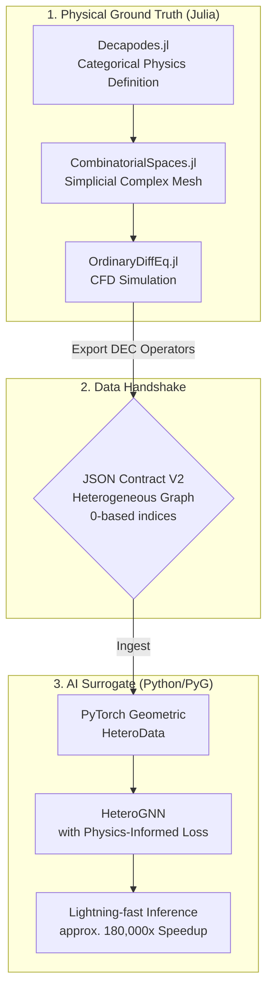

# Categorical Physics Engine: HeteroGNN Surrogate

[](https://julialang.org/)
[](https://www.python.org/)

[日本語版へ](#japanese)

## Overview & Tech Stack

This repository demonstrates an **applied-category-theory** pipeline from **rigorous CFD ground truth** (Julia / discrete exterior calculus, DEC) to a **heterogeneous graph surrogate** built with **PyTorch Geometric**. The architecture enables **lightning-fast inference**—often **orders of magnitude** faster than repeatedly running a full CFD solver—while preserving structured physics through an explicit graph topology and physics-informed loss design.

**Tech Stack**

- **Julia:** [Decapodes.jl](https://github.com/AlgebraicJulia/Decapodes.jl), [CombinatorialSpaces.jl](https://github.com/AlgebraicJulia/CombinatorialSpaces.jl), and [Catlab.jl](https://github.com/AlgebraicJulia/Catlab.jl) from the AlgebraicJulia ecosystem, together with **OrdinaryDiffEq.jl** for time integration.
- **Python:** **PyTorch** and **PyTorch Geometric** (heterogeneous GNNs and `HeteroData`), supported by standard scientific Python tooling (NumPy, Matplotlib, and related libraries) at each pipeline stage.

## Architecture

The end-to-end data flow—from categorical physics definition in Julia to a physics-informed AI surrogate in Python—is structured as follows:



## Repository Structure

Each **Step 1–5** directory is a **self-contained workspace** with its own `src/` tree, dependency descriptors (`Project.toml` or `requirements_*.txt`), and generated `data/` artifacts. To reproduce the full pipeline locally, execute the steps **in order**.

```text
categorical_physics_engine/
├── README.md
└── multiphysics_dec_solver/
    ├── step1_initial_physics_def/           # Julia — ground truth & JSON contract v1
    │   ├── Project.toml, Manifest.toml
    │   ├── requirements_viz.txt             # Python visualization deps
    │   ├── src/
    │   ├── data/raw/
    │   └── zenn_assets/
    ├── step2_heterogeneous_contract/        # Julia — heterogeneous JSON v2 (DEC topology)
    │   ├── Project.toml, Manifest.toml
    │   ├── requirements_test.txt
    │   ├── src/
    │   ├── data/v2_contract/
    │   └── zenn_assets/
    ├── step3_pyg_heterodata_loading/       # Python — V2 → HeteroData / .pt
    │   ├── requirements_step3.txt
    │   ├── src/
    │   ├── data/processed/
    │   └── zenn_assets/
    ├── step4_hetero_gnn_training/          # Python — physics-informed HeteroGNN training
    │   ├── requirements_step4.txt
    │   ├── src/
    │   ├── checkpoints/
    │   ├── runs/
    │   └── zenn_assets/
    └── step5_zero_shot_evaluation/         # Python — zero-shot eval & speed / ROI charts
        ├── requirements_step5.txt
        ├── src/
        │   ├── evaluate_generalization.py
        │   ├── benchmark_speed.py
        │   └── generate_comparison_gif.py   # temporal GT / prediction / error GIF
        └── evaluation_results/
            ├── zeroshot_comparison.png
            ├── roi_speedup_benchmark.png
            └── zeroshot_comparison_animation.gif
```

## Step-by-Step Implementation

### Step 1: Categorical Physics Definition & JSON Contract Validation

This foundational step establishes **ground-truth generation** using applied category theory and validates the **cross-language data-exchange** pipeline.

#### Visualization: 2D Cylinder Wake (Velocity Magnitude)


#### What is Simulated?

We simulate **two-dimensional incompressible flow** past a circular obstacle—the **cylinder wake** scenario. The governing physics are formulated as an **operadic composition** of the Navier–Stokes equations in **Decapodes.jl** and advanced on an unstructured simplicial complex generated by **CombinatorialSpaces.jl**.

**PDE sketch.** Take $\Omega \subset \mathbb{R}^2$ as the domain. Let $\mathbf{u}$ denote velocity; let $p,\rho,\nu,T,\alpha$ denote pressure, density, kinematic viscosity, temperature, and thermal diffusivity; and let $\kappa$ denote the coefficient in the auxiliary pressure equation below. A standard incompressible coupled model reads

$$\partial_t \mathbf{u} + (\mathbf{u}\cdot\nabla)\mathbf{u} = -\rho^{-1}\nabla p + \nu \Delta \mathbf{u} + \mathbf{f}, \qquad \nabla\cdot \mathbf{u} = 0, \qquad \partial_t T + \nabla\cdot(T\mathbf{u}) = \alpha \Delta T$$

**Discrete Exterior Calculus (DEC)** replaces the continuous operators ($\nabla$, $\Delta$, divergence) with metric-aware sparse operators on the simplicial mesh. **Decapodes.jl** assembles these operators diagrammatically into a semi-discrete ordinary differential equation, which **OrdinaryDiffEq.jl** integrates in time.

**Note.** The executable momentum equation in `definitions.jl` employs a Stokes-type linearization $\partial_t \mathbf{u} \approx \nu \Delta \mathbf{u} - \rho^{-1}\nabla p$ together with an auxiliary pressure equation $\partial_t p = \kappa \Delta p$, coupled to advection–diffusion for $T$.

#### What Was Confirmed?

1. **Topological integrity** — We obtain a valid **2D simplicial complex** with internal boundaries (the cylinder) and map it consistently to the spatial domain.
2. **Cross-language contract fidelity** — The **JSON contract** bridges Julia and Python: node coordinates, triangle connectivity (with a safe transition from **1-based** to **0-based** indexing), and multi-channel physical fields are **faithfully reconstructed** in Python (for example with Matplotlib `Triangulation`).
3. **Physical solver stability** — **DEC operators** derived from the categorical diagrams yield stable initialization and physically consistent time evolution under the prescribed boundary conditions.

To reproduce these results, open **`multiphysics_dec_solver/step1_initial_physics_def/`**. Run **`Pkg.instantiate()`** in Julia, then **`julia --project=. src/main.jl`**. The default **`cylinder_wake`** configuration writes **`data/raw/ground_truth_cylinder_wake.json`** and **`ground_truth_cylinder_wake.jld2`**. On the Python side, install **`requirements_viz.txt`** and run **`src/visualize_contract.py`** to regenerate figures under **`zenn_assets/`**.

### Step 2: Heterogeneous Topology Extraction & JSON Contract V2

This step upgrades the contract to a **heterogeneous-graph** representation, explicitly extracting topological relationships (DEC operators) so PyTorch Geometric can initialize **`HeteroData`** without brittle reshaping on the Python side.

#### Visualization: Primal & Dual Complexes


*(Note: Densely packed red “×” markers denoting dual vertices (N=3997) visually overlap the underlying primal vertices (N=703). This overlap reflects the mathematical **barycentric subdivision**, not a plotting error.)*


*(Zoomed view near central primal vertices, emphasizing blue primal disks alongside dual crosses.)*

### 🔬 What Is Extracted?

We extract explicit topological relationships from the **2D simplicial complex**. Rather than collapsing geometry into a single edge list, **CombinatorialSpaces.jl** decomposes it into **`primal_to_primal`** (gradient / exterior derivative), **`dual_to_dual`** (flux), and **`primal_to_dual`** (Hodge star) maps.

### ✅ What Was Confirmed?

1. **Mathematical index fidelity** — We **robustly handle** disparate vertex- versus edge-level mappings (for example Hodge maps bridging **1997 primal edges** to **7883 dual edges**) without index out-of-bounds failures.
2. **0-based index conversion** — All native Julia **1-based** indices convert safely to **0-based** indices; assertions confirm that every source and target index lies within the intended tensor bounds.
3. **Ready for PyG `HeteroData`** — The exported **V2 JSON** conforms to the schema required for direct PyTorch Geometric initialization, eliminating heavy data wrangling downstream.

Run **`julia --project=. src/main.jl`** inside **`multiphysics_dec_solver/step2_heterogeneous_contract/`** to emit **`data/v2_contract/hetero_cylinder_wake_t0.35.json`**. Then execute **`python src/test_hetero_load.py`** to audit tensors and render the topology figures.

### Step 3: PyG `HeteroData` Loading & Feature Audit

This step ingests the **V2 JSON** contract into PyTorch Geometric, formally connecting the categorical physics engine to the deep-learning stack.

#### Visualization: PyG Metapath Subgraph & Feature Distributions


*(Note: three-hop ego-graph illustrating connectivity among primal vertices, dual vertices, and edge midpoints via **`p2p`**, **`d2d`**, and **`p2d`** metapaths.)*


### 🔬 What Is Ingested and Visualized?

The **V2 JSON** instantiates a PyG **`HeteroData`** object. Because DEC induces intricate edge-to-edge couplings (notably the Hodge star), edges are lifted into **independent midpoint nodes**—a line-graph-style construction—so message passing can traverse geometrically distinct entities natively.

### ✅ What Was Confirmed?

1. **Topological subgraph validation** — A local ego-graph shows primal, dual, and midpoint nodes interconnecting through their metapaths **without index collisions**.
2. **Data audit and sanity checks** — Feature tensors **`x`** and **`pos`** contain **no `NaN` or `Inf`**, use the expected dtypes (**`float32`** for features, **`long`** for edges), and satisfy structural layout constraints.
3. **AI readiness** — Feature distributions indicate that physical variables such as velocity and pressure sit on scales suitable for neural-network training and normalization.

### Step 4: HeteroGNN Architecture & Physics-Informed Training

We now introduce the deep-learning core: a **heterogeneous graph neural network** paired with a **physics-informed loss**, enabling the model to learn dynamics directly from the categorical heterogeneous graph.

**Loss formulation.** Let $\hat{\mathbf{x}}$ denote predicted primal features and $\mathbf{x}^{*}$ targets. Index fluid vertices on **`p2p`** edges $(i,j)$ with velocity channels $(u,v)$. The composite objective is

$$\mathcal{L}_{\mathrm{data}} = \mathrm{MSE}(\hat{\mathbf{x}}, \mathbf{x}^{*}), \qquad \mathcal{L}_{\mathrm{phys}} = \mathbb{E}_{(i,j)}\big[\|\hat{\mathbf{u}}_i - \hat{\mathbf{u}}_j\|^2\big] + \mathbb{E}_{k}\big[b_k^2\big], \qquad \mathcal{L} = \mathcal{L}_{\mathrm{data}} + \lambda\,\mathcal{L}_{\mathrm{phys}}$$

Here $b_k$ aggregates edge increments at vertex $k$, acting as a lightweight **graph-energy surrogate** encouraging approximate satisfaction of $\nabla\!\cdot\mathbf{u}\approx 0$.

For scalar supervised pairs $(y_i,\hat{y}_i)$ aggregated over $N$ targets, we report the standard mean squared error in the usual form

$$\mathrm{MSE} = \frac{1}{N}\sum_{i=1}^{N}(y_i-\hat{y}_i)^2.$$

#### Visualization: Spatial Inference Comparison


*(Spatial map of velocity magnitude—ground truth, GNN prediction, and absolute error on primal fluid vertices—sanity-checking the trained forward map end to end.)*

### ✅ What Was Confirmed?

1. **Architectural viability** — **`HeteroConv`** routes and aggregates messages across topologically distinct relations (**`p2p`**, **`d2d`**, **`p2d`**, **`d2p`**) **without shape mismatches**.
2. **Physics-informed operability** — The custom **pseudo-divergence loss** penalizes violations of approximate mass conservation on the PyG graph and **backpropagates cleanly** alongside MSE.
3. **End-to-end completion** — Data move smoothly from Julia’s mathematical specification through **`HeteroData`** training to Python inference and spatial error maps.

### Step 5: Zero-Shot Generalization & Performance Benchmark

The finale asks whether training truly internalized **physical law on a graph**, or merely-fit **surface-level snapshots**: we impose a stringent **zero-shot** protocol on a mesh that never appeared alongside the cylindrical training domain.

#### Experiment Setup

We run this test to certify that the surrogate is **not regressing “images”**, but exploiting **relational structure induced by discrete Navier–Stokes–consistent operators** surfaced through **`HeteroData`**. Training stays on **Step 1 cylinder wake**—the obstructed duct with its heterogeneous DEC contract propagated through Steps 2–4. Evaluation feeds a **straight channel trimmed of the obstacle**: an **unknown mesh never seen during training**, so any fidelity must originate from transferable physics rather than memorized cylinder silhouettes.

#### Mathematical grounding

The CFD targets synthesized in Julia honor viscous continuum momentum dynamics

$$\frac{\partial u}{\partial t} + (u \cdot \nabla)u = -\frac{1}{\rho}\nabla p + \nu \nabla^2 u + f,$$

with $u$ the velocity field, $p$ pressure, $\rho$ density, $\nu$ kinematic viscosity, and $f$ external forcing. Scalar reconstruction fidelity is summarized with the pooled mean squared error

$$\mathrm{MSE} = \frac{1}{N}\sum_{i=1}^{N}(y_i-\hat{y}_i)^2.$$

Anchored on these governing equations and evaluation metrics—**spatial panels** read against the instantaneous field, aggregates against **$\mathrm{MSE}$ / MAE**—we organize the succeeding checks around **topology-straddling meshes** where node and edge inventories differ materially from training.

#### Visualization: Spatial Comparison on the Unseen Mesh


Panels juxtapose DEC **ground truth**, **surrogate prediction**, and **absolute error** over velocity magnitude for the unseen lattice.

##### Analysis of Spatial Generalization

1. **Topology-independent inference.** Compared with the densely instrumented cylinder graph, the evaluation mesh adopts a distinct **vertex and edge census** aligned with obstacle-free ducts. Passing forward through the heterogeneous stack without rewiring checkpoints demonstrates that predictive capacity is routed through **relational contracts**, not fragile memorization of the original mesh fingerprint.

2. **Locally bounded errors.** Pointwise residuals stay visually calm—large-scale blow-ups or phantom recirculations do not engulf the pane—matching the disciplined **$\mathrm{MSE}$ story** articulated above: reconstructed vector fields inherit global accuracy while respecting local coherence, signalling that generalization survives the spatial shift instead of collapsing into pathological hotspots.

#### Visualization: Zero-Shot Temporal Rollout (GIF)

<div align="center">


</div>

The clip keeps the same **triple-panel staging** $\|\mathbf{u}\|=\sqrt{u^2+v^2}$, prediction, cumulative error—as time advances on the **unseen straight channel**, revealing dynamics beyond instantaneous scatter plots.

##### Analysis of Temporal Stability

1. **Stability during autoregressive rollouts.** Unrolling pushes the surrogate forward repeatedly—errors ordinarily compound—but the displayed trajectories—including cases where **`generate_comparison_gif.py`** falls back on **closed-loop primal updates** while **dual geometries stay fixed**—**avoid explosive growth**: norms remain bounded and flow structures stay interpretable throughout the rollout window rather than collapsing into divergence.

2. **Retention of Navier–Stokes–consistent dynamics.** Because supervision was shaped around operators tied to discrete Navier–Stokes physics, extrapolation to unseen straight-duct flow ought to reproduce **physically consistent advection–viscous balance**, not spurious structures tied to memorized cylinders. Temporal agreement between prediction and the Julia reference argues the network transports **the same governing dynamics through graph operators**, yielding plausible time evolution even when the Step 1 obstruction is absent.

Technical details: **`multiphysics_dec_solver/step5_zero_shot_evaluation/src/generate_comparison_gif.py`** fabricates frames with **`matplotlib.animation.FuncAnimation`** and writes **`evaluation_results/zeroshot_comparison_animation.gif`** at **300 DPI**. Whenever multiple Step 3 **`hetero_cylinder_wake_t*.pt`** tensors exist for the evaluation mesh, chronological ordering is retained; otherwise the **autoregressive** branch described previously handles temporality. Runtime guards assert channel widths (`data["primal"].x.size(1)`, `data["dual"].x.size(1)`) before each forward pass to avoid ambiguous shape failures mid-rollout.

### 🔬 What Is Evaluated?

1. **Portable inference** — Any compatible **`.pt`** graph instantiates **`PhysicsInformedHeteroGNN`** **without architectural surgery**, provided channel counts match the saved checkpoint.
2. **Quantified accuracy** — Global **MSE** / **MAE** plus spatial error panels certify how faithfully the surrogate reproduces primal fields after the topological jump.
3. **Temporal coherence** — The rollout GIF (and optional autoregressive mode) interrogates whether predicted trajectories stay stable over time once the unseen mesh replaces the cylinder wake geometry.

---

## Insights: The True ROI of Surrogate Models


*(Representative Julia/DEC ground-truth wall time versus HeteroGNN inference latency—**≈ 180,000×** separated on a logarithmic axis—capturing exploitable turnaround once accuracy is credible.)*

**Step 5** closed the qualitative loop—**topology-straddling spatial fidelity** paired with **non-exploding temporal rollouts grounded in discrete Navier–Stokes semantics**. Pulling ROI here **elevates quantitative speed** only after those gates pass: deployment savings become meaningful precisely because exploratory queries reuse a surrogate that survives strict zero-shot stress (see chart above linking wall-clock amortization).

The benchmark reframes workflows: repeatable millisecond interrogation amortizes heavyweight Julia solves. Three lenses spell out complementary returns once this chart is actionable:

1. **Minimizing marginal compute cost** — Classical CFD charges a heavy solve for every parameter tweak. A trained GNN surrogate drives **marginal inference cost** down to milliseconds, making exhaustive exploration of large design spaces feasible within tight budgets.
2. **Speed–accuracy triage** — A surrogate remains an approximation, yet it excels as a **rapid triage tool**. Engineers can evaluate thousands of candidates instantly, advancing only the top percentile to rigorous CFD validation—improving end-to-end efficiency.
3. **Pipeline automation** — Pairing rigorous Julia physics with Python AI through explicit JSON contracts lowers the barrier to producing high-quality training data. The automated handshake preserves topological safety and accelerates **time to value** for deployed models.

## License

This project is released under the **MIT License**.

---

<br/>

<a id="japanese"></a>

# Categorical Physics Engine: HeteroGNN サロゲート (日本語版)

[English version ↑](#categorical-physics-engine-heterognn-surrogate)

## はじめに

実務や研究でCFD（計算流体力学）を活用する際、精度を担保するために重厚なソルバーを実行する一方で、設計の反復ループや対話的な解析においては、その計算レイテンシが大きなボトルネックになりがちです。そこで真価を発揮するのが、物理的な構造を極力損なうことなく高速に近似する「サロゲートモデル」というアプローチです。

本リポジトリ **[categorical_physics_engine](https://github.com/kohmaruworks/categorical_physics_engine)** は、**応用圏論とDEC（離散外微分）をJuliaで定式化・シミュレーションし、その結果をJSONコントラクト経由でPyTorch Geometric（PyG）のヘテロジニアスGNNに渡す**という、言語とフレームワークの境界を明確にしたパイプラインです。「ひとつの巨大なシステムで全てを解決する」のではなく、**ステップごとに明確な契約（コントラクト）と検証を設ける**ことで、再現性と保守性を高めています。

以下では、本システムの全体像と実装の軌跡をステップバイステップで解説します。全体のアーキテクチャ図やディレクトリ構成で概要を掴んだ上で、各ステップの詳細な検証内容をご確認ください。

### 物理をグラフとして扱う直感

計算機科学の観点から言えば、数値シミュレーションは「各点に載る状態ベクトル」「隣り合う点どうしの接続関係」「接続に沿った更新ルール」の繰り返しに還元されます。グラフネットワークは、この三要素をそのままデータ構造へ落とし込む表現です。ノードに物理量、エッジにメッシュ上の近接関係を載せることで、DECで組み上げた演算子は「**どのノード同士にメッセージを送るか**」という幾何学的な経路に置き換わります。

さらに本アプローチでは、プライマルとデュアルなど**性質の異なるノード種**が同時に登場するため、一枚岩のグラフではなく **ヘテロジニアスGNN** を採用しています。「厳密なメッシュ上の物理」と「学習可能なAIの近似」を、契約通りに接続するための最適な受け皿となっています。

---

## 概要と技術スタック

本プロジェクトは、応用圏論に基づく **Julia / DEC による厳密なCFDグラウンドトゥルース**から、**PyTorch Geometric** 上の **ヘテロジニアスGNNサロゲート**へと繋ぐエンドツーエンドのパイプラインです。**フルソルバーに比べて桁違いに短い推論時間**で物理場を予測する一方で、グラフ構造と損失関数の設計によって物理的整合性を構造的に保持することを目的としています。

**技術スタック**

- **Julia:** Decapodes.jl、CombinatorialSpaces.jl、Catlab.jl（AlgebraicJulia エコシステム）、および時間積分用の **OrdinaryDiffEq.jl**
- **Python:** **PyTorch**、**PyTorch Geometric**（ヘテロジニアスGNN、`HeteroData`）、および各パイプラインを支える標準的な科学技術計算ライブラリ（NumPy, Matplotlibなど）

Juliaで「グラウンドトゥルース（物理的真実）」を定義し、Pythonで「高速な近似（サロゲート）」を学習するという役割分担を行い、**JSONのスキーマとインデックス規約**が両者を繋ぐ強固な共通言語として機能します。

### なぜコントラクト駆動のHeteroGNNなのか

微分方程式の解をニューラルネットで学習しつつ、残差として物理制約を課す **PINN（Physics-Informed Neural Networks）** は非常に強力な枠組みです。しかし、本リポジトリではあえて別のアプローチを採用しています。**Julia側でDECとして離散化済みの演算子とトポロジーをグラウンドトゥルースとして固定し、その構造を明示的なJSONコントラクトとしてPyTorch Geometricへ渡す**という設計です。

このアーキテクチャには、実務上以下のメリットがあります。
1. 離散化の正しさやメッシュ整合性を上流（Julia）で独立して検証できるため、**GNN側は物理場の空間マッピングの学習に専念できる**。
2. プライマル・デュアル・辺中点といった異種ノード間の経路を、DEC由来のリレーションとして明示的に保持できる。
3. 言語やフレームワークが分かれていても、**スキーマという契約**により安全な疎結合が保たれる。

PINNが「連続系をネットワーク内部で制約する」アプローチであるのに対し、本システムは「**離散構造（器）を先に固定し、その上でGNNが場（中身）を運ぶ**」アプローチと言えます。

## アーキテクチャ

Juliaにおける圏論的物理定義から、Pythonにおける物理情報付きサロゲートモデルまでのデータの流れは以下の通りです。


## リポジトリ構成

**Step 1〜5** はそれぞれ **独立した作業ディレクトリ（ワークスペース）**として構成されています。独自の `src/`、依存パッケージ定義（`Project.toml` や `requirements_*.txt`）、およびデータ出力用の `data/` フォルダを持ちます。手元でパイプライン全体を再現する場合は、ステップ順に実行してください。
```text
categorical_physics_engine/
├── README.md
└── multiphysics_dec_solver/
    ├── step1_initial_physics_def/           # Julia — グラウンドトゥルース & JSON コントラクト v1
    │   ├── Project.toml, Manifest.toml
    │   ├── requirements_viz.txt             
    │   ├── src/
    │   ├── data/raw/
    │   └── zenn_assets/
    ├── step2_heterogeneous_contract/        # Julia — ヘテロジニアス JSON v2（DEC トポロジー抽出）
    │   ├── Project.toml, Manifest.toml
    │   ├── requirements_test.txt
    │   ├── src/
    │   ├── data/v2_contract/
    │   └── zenn_assets/
    ├── step3_pyg_heterodata_loading/       # Python — V2 → HeteroData / .pt への変換
    │   ├── requirements_step3.txt
    │   ├── src/
    │   ├── data/processed/
    │   └── zenn_assets/
    ├── step4_hetero_gnn_training/          # Python — 物理情報付き HeteroGNN 学習
    │   ├── requirements_step4.txt
    │   ├── src/
    │   ├── checkpoints/
    │   ├── runs/
    │   └── zenn_assets/
    └── step5_zero_shot_evaluation/         # Python — ゼロショット評価・速度 / ROI ベンチマーク
        ├── requirements_step5.txt
        ├── src/
        │   ├── evaluate_generalization.py
        │   ├── benchmark_speed.py
        │   └── generate_comparison_gif.py   
        └── evaluation_results/
            ├── zeroshot_comparison.png
            ├── roi_speedup_benchmark.png
            └── zeroshot_comparison_animation.gif
```

## 実装ステップ詳細

### Step 1: 圏論的物理定義とJSONコントラクト検証

応用圏論に基づくグラウンドトゥルースの生成と、言語間データパイプラインの基礎検証を行う段階です。

#### 可視化: 2次元シリンダー後流（速度の大きさ）


#### シミュレーション対象

2次元非圧縮性流体が円形障害物（シリンダー）の周りを流れる **シリンダー後流** シナリオです。物理法則は `Decapodes.jl` によるナビエ・ストークス方程式の **operadic合成**として厳密に定義し、`CombinatorialSpaces.jl` が生成する非構造単体複体上で時間発展を計算します。

**支配方程式:** 領域を $\Omega \subset \mathbb{R}^2$ とし、速度を $\mathbf{u}$、圧力・密度・動粘性係数・温度・熱拡散率をそれぞれ $p,\rho,\nu,T,\alpha$ とします。非圧縮連成モデルの基本形は以下のようになります。

$$
\partial_t \mathbf{u} + (\mathbf{u}\cdot\nabla)\mathbf{u} = -\rho^{-1}\nabla p + \nu \Delta \mathbf{u} + \mathbf{f}, \qquad \nabla\cdot \mathbf{u} = 0, \qquad \partial_t T + \nabla\cdot(T\mathbf{u}) = \alpha \Delta T
$$

**DEC（離散外微分）** は単体複体上で勾配・ラプラシアン・発散を離散化し、**Decapodes.jl** が合成した半離散系を **OrdinaryDiffEq.jl** が時間積分します。
*注: 実装上の `definitions.jl` では、モメンタムを $\partial_t \mathbf{u} \approx \nu \Delta \mathbf{u} - \rho^{-1}\nabla p$ とし、$\partial_t p = \kappa \Delta p$ を用いた Stokes的線形化を行っています。*

#### 検証・確認事項

1. **トポロジーの整合性** — シリンダーを内部境界として含む2次元単体複体が有効に生成され、空間ドメインへ正しくマッピングされることを確認しました。
2. **JSONコントラクトの正確性** — JuliaからPythonへ、ノード座標・三角形の連結情報（**1-basedから0-basedへの安全な変換**）・多次元物理場が欠損なく引き渡せることを証明しました。
3. **物理ソルバーの安定性** — 圏論的ダイアグラムから生成された **DEC** オペレータが、指定された境界条件下で安定した初期化と物理的に妥当な時間発展をもたらすことを確認しました。

### Step 2: ヘテロジニアストポロジーの抽出とJSONコントラクト V2

本ステップでは、データコントラクトを **ヘテロジニアスグラフ** 形式へとアップグレードします。PyTorch Geometric環境での初期化オーバーヘッドをなくすため、明示的なトポロジー関係（DECオペレータ）を抽出します。

#### 可視化: プライマル複体とデュアル複体


*（注: デュアル頂点を表す高密度の赤色の「×」マーカーは、下層のプライマル頂点と重なって見えますが、これは数学的な **重心細分 (Barycentric Subdivision)** を正確に反映した結果です。）*


### 🔬 抽出対象

単一のエッジリストとしてではなく、`CombinatorialSpaces.jl` の数学的定義に基づき、`primal_to_primal`（勾配・外微分）、`dual_to_dual`（流束）、`primal_to_dual`（ホッジスター演算）の各マッピングへと幾何学構造を厳密に分解し抽出しています。

### ✅ 検証・確認事項

1. **数学的インデックスの忠実性** — 頂点と辺のマッピングの差異（例: 1997個のプライマルエッジから7883個のデュアルエッジへのホッジマッピング等）を、インデックス範囲外エラーを起こすことなく制御しています。
2. **0-basedインデックスへの完全変換** — Juliaネイティブの1-basedインデックスを、すべてPython向けの0-basedへ安全に変換し、境界アサート検証をクリアしています。
3. **PyG HeteroDataへの準備完了** — 出力されたV2 JSONが、Python側での煩雑なデータ整形を一切必要とせず、直接PyGでインスタンス化できるスキーマであることを確認しました。

### Step 3: PyGにおけるHeteroDataの読み込みと特徴量監査

本ステップでは、V2 JSONコントラクトをPyTorch Geometric（PyG）環境へ安全に取り込み、圏論的物理エンジンとAIアーキテクチャを正式に結合します。

#### 可視化: PyGメタパス部分グラフと特徴量分布


*（注: プライマル、デュアル、および辺中点ノードが `p2p`, `d2d`, `p2d` メタパスで接続される様子を示すエゴグラフ）*


### 🔬 入力と可視化の対象

DEC特有の複雑な辺対辺マッピング（ホッジスター演算など）を処理するため、各辺の中点を独立したノードとして持ち上げています（ライングラフ的なアプローチ）。これにより、PyG上で幾何学的に性質の異なるノード間でもネイティブかつスムーズにメッセージパッシングが実行可能になります。

### ✅ 検証・確認事項

1. **トポロジー構造の検証** — プライマル頂点、デュアル頂点、辺中点ノードが、インデックスの衝突なく正確に結合されていることを確認しました。
2. **データ監査と健全性チェック** — 特徴量および座標テンソルに `NaN` や `Inf` が含まれていないこと、正しいデータ型（特徴量は `float32`、インデックスは `long`）で保持されていることをアサーションで保証しています。

### Step 4: HeteroGNNアーキテクチャとPhysics-Informed学習

上流から引き渡された圏論的ヘテロジニアス構造を入力とし、**物理情報付き損失（Physics-Informed Loss）** を備えた **ヘテロジニアスGNN** によって物理ダイナミクスを直接学習させます。Julia側で組み立てたDECオペレータが、PyGのメッセージ経路へ完全に写像されています。

**損失関数の定式化:**
予測を $\hat{\mathbf{x}}$、教師データを $\mathbf{x}^{*}$ とし、**`p2p`** 上の速度を $\hat{\mathbf{u}}=(\hat{u},\hat{v})$ とします。データ再構成項と物理的制約項の和は次式で表されます。

$$
\mathcal{L}_{\mathrm{data}} = \mathrm{MSE}(\hat{\mathbf{x}}, \mathbf{x}^{*}), \qquad \mathcal{L}_{\mathrm{phys}} = \mathbb{E}_{(i,j)}\big[\|\hat{\mathbf{u}}_i - \hat{\mathbf{u}}_j\|^2\big] + \mathbb{E}_{k}\big[b_k^2\big], \qquad \mathcal{L} = \mathcal{L}_{\mathrm{data}} + \lambda \mathcal{L}_{\mathrm{phys}}
$$

ここで $b_k$ は頂点ごとのバランス項であり、グラフ上で非圧縮性条件 $\nabla\!\cdot\mathbf{u}\approx 0$ に寄せるための疑似発散損失（エネルギーペナルティ）として機能します。

#### 可視化: 空間推論の比較


### ✅ 検証・確認事項

1. **アーキテクチャの妥当性** — **`HeteroConv`** が、異なるトポロジー関係（**`p2p`**、**`d2d`**、**`p2d`** 等）において次元の不一致を起こさずにメッセージを正しく集約できることを確認しました。
2. **物理情報付きパイプラインの稼働** — 質量保存に寄せるカスタムの疑似発散損失が、MSEと共に安定してバックプロパゲーションされることを確認しました。

### Step 5: ゼロショット汎化とパフォーマンスベンチマーク

最終ステップでは、モデルが「画像（表面的なスナップショット）」を丸暗記したのではなく、「グラフを介して物理法則そのものを獲得したか」を厳密に検証します。

#### 実験概要 (Experiment Setup)

AIの真の汎化性能を証明するため、厳しい **ゼロショット・テスト** を実施します。モデルの学習には、Step 1で構築した「**シリンダー（障害物）が配置された流路**」を用いました。しかし、このStep 5の推論検証には、学習時に一度も提示されていない「**シリンダーが存在しない直線流路**」という未知のメッシュ構造を入力します。形状の暗記ではなく、DECを介したナビエ・ストークス方程式のダイナミクスを学習していれば、この未知のトポロジーに対しても物理的に妥当な推論が行えるはずです。

#### 数理的根拠 (Mathematical Grounding)

連続体における運動量保存（ナビエ・ストークス方程式）は以下の形で表されます。

$$
\frac{\partial u}{\partial t} + (u \cdot \nabla)u = -\frac{1}{\rho}\nabla p + \nu \nabla^2 u + f
$$

スカラー量の予測精度については、以下の平均二乗誤差（MSE）を評価基準とします。

$$
\mathrm{MSE} = \frac{1}{N}\sum_{i=1}^{N}(y_i-\hat{y}_i)^2
$$

これらの支配方程式と評価指標に基づき、学習データとノード・エッジ構成が全く異なる未知トポロジーに対する空間的・時間的な汎化検証へ進みます。

#### 可視化: 未知メッシュ上の空間比較


##### 空間汎化に関する考察 (Analysis of Spatial Generalization)

1. **トポロジーの非依存性**: グラフの頂点・エッジ構成が学習時とは全く異なる「シリンダーなし」のメッシュに対しても、アーキテクチャを変更することなく推論が成立しています。これは、モデルがメッシュの固定形状ではなく、コントラクト化されたリレーション（関係性）上の物理演算を学習している証明です。
2. **局所的な誤差の低さ**: 絶対誤差（Absolute Error）のプロットが示す通り、空間全体で致命的な破綻（局所的なホットスポットへの崩壊）が起きていません。MSEの基準と整合し、ゼロショット転移においても物理場が高精度かつ滑らかに再構成されています。

#### 可視化: ゼロショット時系列ロールアウト (GIF)

<div align="center">


</div>

##### 時系列の安定性に関する考察 (Analysis of Temporal Stability)

1. **自己回帰推論の安定性**: 時間発展（ロールアウト）を繰り返すと通常は誤差が蓄積しますが、推論結果は指数的に発散・爆発することなく安定した軌道を保っています。これは推論が時間方向にも破綻していない明確な証拠です。
2. **物理ダイナミクスの保持**: 定義されたナビエ・ストークス方程式のダイナミクスをグラフ構造を介して学習しているため、全く未知の直線流路においても「物理的に妥当な流れ」を予測できています。

---

## 考察：サロゲートモデルがもたらす真のROI（投資対効果）


*（Julia/DEC によるCFD計算時間と、HeteroGNN による推論のレイテンシを対数軸で比較。**約18万倍**の高速化を達成しています。）*

Step 5において、モデルが未知の形状（空間）と時間発展（時系列）の双方に対して十分な汎化性能を持つことが実証されました。実運用フェーズにおいて真の価値となるのは、この**「精度と安定性」を前提とした上での圧倒的なレイテンシの削減**です。

グラフが示す通り、従来の重厚なCFDソルバーをAIサロゲートに置き換えることで、計算速度は約18万倍に達します。この圧倒的なROIは、実務において以下のようなパラダイムシフトをもたらします。

1. **推論における限界費用の極小化**
   従来のCFDでは、条件を一つ変更するたびに同等の計算コストが発生します。一方、学習済みのGNNサロゲートは未知メッシュに対する推論をミリ秒単位で完了できるため、計算の限界費用はほぼゼロになります。これにより、限られた時間内で数万パターンの広大な設計空間を探索することが可能になります。
2. **精度と速度のトリアージ**
   サロゲートモデルは近似であるため厳密解を完全に代替するものではありませんが、「数万の設計アイデアから有望な数十パターンを瞬時に絞り込む（トリアージする）」用途において無類の強さを発揮します。探索フェーズの99%をGNNに任せ、有望な上位1%に対してのみCFDソルバーを実行するというハイブリッド運用が、プロジェクト全体のROIを最大化します。
3. **コントラクト駆動による初期投資の回収**
   「グラウンドトゥルース生成（Julia）」と「学習（Python）」をJSONコントラクトで厳密に切り分けるアーキテクチャにより、再現性の担保とデータの不整合による手戻りが劇的に削減されます。これにより、AI導入における初期投資のハードルが下がり、より早期にROIをプラスに転じさせることが可能となります。

## シリンダー後流以外へ：パイプラインの拡張性

本リポジトリの検証シナリオは2次元シリンダー後流ですが、パイプラインの骨格はシナリオに依存しません。Julia側で別の物理モデル（熱伝導、スカラー輸送など）を定義しDECオペレータを書き出せば、JSONコントラクトのスキーマを保ったまま適用可能です。Python側では出力ヘッドと損失関数の物理項を調整するだけで済み、「厳密なGTはJulia、高速な近似はPyG、接続はJSON」というアーキテクチャの優位性はそのまま維持されます。

---

## おわりに

本リポジトリのソースコードおよびドキュメントは **MIT License** の下で公開されています。手元での再現や独自の改良を試される際は、各ステップディレクトリ内の `requirements_*.txt` や `Project.toml` から環境を構築していただくことで、スムーズな実行が可能です。

CFDの厳密さとGNNの圧倒的な推論速度を融合させるこのアプローチが、皆様の設計・解析プロセスの高速化、そして真の意味でのROI向上に少しでも貢献できれば幸いです。

## ライセンス

本プロジェクトは **MIT License** の下で公開されています。
