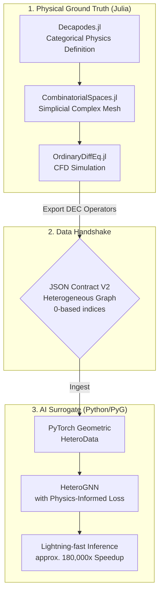
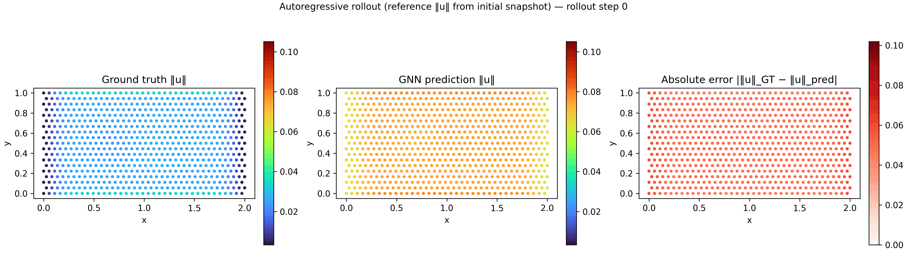

# Categorical Physics Engine: HeteroGNN Surrogate

[](https://julialang.org/)
[](https://www.python.org/)

[日本語版へ](#japanese)

## Overview & Tech Stack

This repository demonstrates an **applied-category-theory** pipeline from **rigorous CFD ground truth** (Julia / discrete exterior calculus, DEC) to a **heterogeneous graph surrogate** built with **PyTorch Geometric**. The architecture enables **lightning-fast inference**—often **orders of magnitude** faster than repeatedly running a full CFD solver—while preserving structured physics through an explicit graph topology and physics-informed loss design.

**Tech Stack**

- **Julia:** [Decapodes.jl](https://github.com/AlgebraicJulia/Decapodes.jl), [CombinatorialSpaces.jl](https://github.com/AlgebraicJulia/CombinatorialSpaces.jl), and [Catlab.jl](https://github.com/AlgebraicJulia/Catlab.jl) from the AlgebraicJulia ecosystem, together with **OrdinaryDiffEq.jl** for time integration.
- **Python:** **PyTorch** and **PyTorch Geometric** (heterogeneous GNNs and `HeteroData`), supported by standard scientific Python tooling (NumPy, Matplotlib, and related libraries) at each pipeline stage.

## Architecture

The end-to-end data flow—from categorical physics definition in Julia to a physics-informed AI surrogate in Python—is structured as follows:



## Repository Structure

Each **Step 1–5** directory is a **self-contained workspace** with its own `src/` tree, dependency descriptors (`Project.toml` or `requirements_*.txt`), and generated `data/` artifacts. To reproduce the full pipeline locally, execute the steps **in order**.

```text
categorical_physics_engine/
├── README.md
└── multiphysics_dec_solver/
    ├── step1_initial_physics_def/           # Julia — ground truth & JSON contract v1
    │   ├── Project.toml, Manifest.toml
    │   ├── requirements_viz.txt             # Python visualization deps
    │   ├── src/
    │   ├── data/raw/
    │   └── zenn_assets/
    ├── step2_heterogeneous_contract/        # Julia — heterogeneous JSON v2 (DEC topology)
    │   ├── Project.toml, Manifest.toml
    │   ├── requirements_test.txt
    │   ├── src/
    │   ├── data/v2_contract/
    │   └── zenn_assets/
    ├── step3_pyg_heterodata_loading/       # Python — V2 → HeteroData / .pt
    │   ├── requirements_step3.txt
    │   ├── src/
    │   ├── data/processed/
    │   └── zenn_assets/
    ├── step4_hetero_gnn_training/          # Python — physics-informed HeteroGNN training
    │   ├── requirements_step4.txt
    │   ├── src/
    │   ├── checkpoints/
    │   ├── runs/
    │   └── zenn_assets/
    └── step5_zero_shot_evaluation/         # Python — zero-shot eval & speed / ROI charts
        ├── requirements_step5.txt
        ├── src/
        │   ├── evaluate_generalization.py
        │   ├── benchmark_speed.py
        │   └── generate_comparison_gif.py   # temporal GT / prediction / error GIF
        └── evaluation_results/
            ├── zeroshot_comparison.png
            ├── roi_speedup_benchmark.png
            └── zeroshot_comparison_animation.gif
```

## Step-by-Step Implementation

### Step 1: Categorical Physics Definition & JSON Contract Validation

This foundational step establishes **ground-truth generation** using applied category theory and validates the **cross-language data-exchange** pipeline.

#### Visualization: 2D Cylinder Wake (Velocity Magnitude)


#### What is Simulated?

We simulate **two-dimensional incompressible flow** past a circular obstacle—the **cylinder wake** scenario. The governing physics are formulated as an **operadic composition** of the Navier–Stokes equations in **Decapodes.jl** and advanced on an unstructured simplicial complex generated by **CombinatorialSpaces.jl**.

**PDE sketch.** Take $\Omega \subset \mathbb{R}^2$ as the domain. Let $\mathbf{u}$ denote velocity; let $p,\rho,\nu,T,\alpha$ denote pressure, density, kinematic viscosity, temperature, and thermal diffusivity; and let $\kappa$ denote the coefficient in the auxiliary pressure equation below. A standard incompressible coupled model reads

$$\partial_t \mathbf{u} + (\mathbf{u}\cdot\nabla)\mathbf{u} = -\rho^{-1}\nabla p + \nu \Delta \mathbf{u} + \mathbf{f}, \qquad \nabla\cdot \mathbf{u} = 0, \qquad \partial_t T + \nabla\cdot(T\mathbf{u}) = \alpha \Delta T$$

**Discrete Exterior Calculus (DEC)** replaces the continuous operators ($\nabla$, $\Delta$, divergence) with metric-aware sparse operators on the simplicial mesh. **Decapodes.jl** assembles these operators diagrammatically into a semi-discrete ordinary differential equation, which **OrdinaryDiffEq.jl** integrates in time.

**Note.** The executable momentum equation in `definitions.jl` employs a Stokes-type linearization $\partial_t \mathbf{u} \approx \nu \Delta \mathbf{u} - \rho^{-1}\nabla p$ together with an auxiliary pressure equation $\partial_t p = \kappa \Delta p$, coupled to advection–diffusion for $T$.

#### What Was Confirmed?

1. **Topological integrity** — We obtain a valid **2D simplicial complex** with internal boundaries (the cylinder) and map it consistently to the spatial domain.
2. **Cross-language contract fidelity** — The **JSON contract** bridges Julia and Python: node coordinates, triangle connectivity (with a safe transition from **1-based** to **0-based** indexing), and multi-channel physical fields are **faithfully reconstructed** in Python (for example with Matplotlib `Triangulation`).
3. **Physical solver stability** — **DEC operators** derived from the categorical diagrams yield stable initialization and physically consistent time evolution under the prescribed boundary conditions.

To reproduce these results, open **`multiphysics_dec_solver/step1_initial_physics_def/`**. Run **`Pkg.instantiate()`** in Julia, then **`julia --project=. src/main.jl`**. The default **`cylinder_wake`** configuration writes **`data/raw/ground_truth_cylinder_wake.json`** and **`ground_truth_cylinder_wake.jld2`**. On the Python side, install **`requirements_viz.txt`** and run **`src/visualize_contract.py`** to regenerate figures under **`zenn_assets/`**.

### Step 2: Heterogeneous Topology Extraction & JSON Contract V2

This step upgrades the contract to a **heterogeneous-graph** representation, explicitly extracting topological relationships (DEC operators) so PyTorch Geometric can initialize **`HeteroData`** without brittle reshaping on the Python side.

#### Visualization: Primal & Dual Complexes


*(Note: Densely packed red “×” markers denoting dual vertices (N=3997) visually overlap the underlying primal vertices (N=703). This overlap reflects the mathematical **barycentric subdivision**, not a plotting error.)*


*(Zoomed view near central primal vertices, emphasizing blue primal disks alongside dual crosses.)*

### 🔬 What Is Extracted?

We extract explicit topological relationships from the **2D simplicial complex**. Rather than collapsing geometry into a single edge list, **CombinatorialSpaces.jl** decomposes it into **`primal_to_primal`** (gradient / exterior derivative), **`dual_to_dual`** (flux), and **`primal_to_dual`** (Hodge star) maps.

### ✅ What Was Confirmed?

1. **Mathematical index fidelity** — We **robustly handle** disparate vertex- versus edge-level mappings (for example Hodge maps bridging **1997 primal edges** to **7883 dual edges**) without index out-of-bounds failures.
2. **0-based index conversion** — All native Julia **1-based** indices convert safely to **0-based** indices; assertions confirm that every source and target index lies within the intended tensor bounds.
3. **Ready for PyG `HeteroData`** — The exported **V2 JSON** conforms to the schema required for direct PyTorch Geometric initialization, eliminating heavy data wrangling downstream.

Run **`julia --project=. src/main.jl`** inside **`multiphysics_dec_solver/step2_heterogeneous_contract/`** to emit **`data/v2_contract/hetero_cylinder_wake_t0.35.json`**. Then execute **`python src/test_hetero_load.py`** to audit tensors and render the topology figures.

### Step 3: PyG `HeteroData` Loading & Feature Audit

This step ingests the **V2 JSON** contract into PyTorch Geometric, formally connecting the categorical physics engine to the deep-learning stack.

#### Visualization: PyG Metapath Subgraph & Feature Distributions


*(Note: three-hop ego-graph illustrating connectivity among primal vertices, dual vertices, and edge midpoints via **`p2p`**, **`d2d`**, and **`p2d`** metapaths.)*


### 🔬 What Is Ingested and Visualized?

The **V2 JSON** instantiates a PyG **`HeteroData`** object. Because DEC induces intricate edge-to-edge couplings (notably the Hodge star), edges are lifted into **independent midpoint nodes**—a line-graph-style construction—so message passing can traverse geometrically distinct entities natively.

### ✅ What Was Confirmed?

1. **Topological subgraph validation** — A local ego-graph shows primal, dual, and midpoint nodes interconnecting through their metapaths **without index collisions**.
2. **Data audit and sanity checks** — Feature tensors **`x`** and **`pos`** contain **no `NaN` or `Inf`**, use the expected dtypes (**`float32`** for features, **`long`** for edges), and satisfy structural layout constraints.
3. **AI readiness** — Feature distributions indicate that physical variables such as velocity and pressure sit on scales suitable for neural-network training and normalization.

### Step 4: HeteroGNN Architecture & Physics-Informed Training

We now introduce the deep-learning core: a **heterogeneous graph neural network** paired with a **physics-informed loss**, enabling the model to learn dynamics directly from the categorical heterogeneous graph.

**Loss formulation.** Let $\hat{\mathbf{x}}$ denote predicted primal features and $\mathbf{x}^{*}$ targets. Index fluid vertices on **`p2p`** edges $(i,j)$ with velocity channels $(u,v)$. The composite objective is

$$\mathcal{L}_{\mathrm{data}} = \mathrm{MSE}(\hat{\mathbf{x}}, \mathbf{x}^{*}), \qquad \mathcal{L}_{\mathrm{phys}} = \mathbb{E}_{(i,j)}\big[\|\hat{\mathbf{u}}_i - \hat{\mathbf{u}}_j\|^2\big] + \mathbb{E}_{k}\big[b_k^2\big], \qquad \mathcal{L} = \mathcal{L}_{\mathrm{data}} + \lambda\,\mathcal{L}_{\mathrm{phys}}$$

Here $b_k$ aggregates edge increments at vertex $k$, acting as a lightweight **graph-energy surrogate** encouraging approximate satisfaction of $\nabla\!\cdot\mathbf{u}\approx 0$.

For scalar supervised pairs $(y_i,\hat{y}_i)$ aggregated over $N$ targets, we report the standard mean squared error in the usual form

$$\mathrm{MSE} = \frac{1}{N}\sum_{i=1}^{N}(y_i-\hat{y}_i)^2.$$

#### Visualization: Spatial Inference Comparison


*(Spatial map of velocity magnitude—ground truth, GNN prediction, and absolute error on primal fluid vertices—sanity-checking the trained forward map end to end.)*

### ✅ What Was Confirmed?

1. **Architectural viability** — **`HeteroConv`** routes and aggregates messages across topologically distinct relations (**`p2p`**, **`d2d`**, **`p2d`**, **`d2p`**) **without shape mismatches**.
2. **Physics-informed operability** — The custom **pseudo-divergence loss** penalizes violations of approximate mass conservation on the PyG graph and **backpropagates cleanly** alongside MSE.
3. **End-to-end completion** — Data move smoothly from Julia’s mathematical specification through **`HeteroData`** training to Python inference and spatial error maps.

### Step 5: Zero-Shot Generalization & Performance Benchmark

The finale asks whether training truly internalized **physical law on a graph**, or merely-fit **surface-level snapshots**: we impose a stringent **zero-shot** protocol on a mesh that never appeared alongside the cylindrical training domain.

#### Experiment Setup

We run this test to certify that the surrogate is **not regressing “images”**, but exploiting **relational structure induced by discrete Navier–Stokes–consistent operators** surfaced through **`HeteroData`**. Training stays on **Step 1 cylinder wake**—the obstructed duct with its heterogeneous DEC contract propagated through Steps 2–4. Evaluation feeds a **straight channel trimmed of the obstacle**: an **unknown mesh never seen during training**, so any fidelity must originate from transferable physics rather than memorized cylinder silhouettes.

#### Mathematical grounding

The CFD targets synthesized in Julia honor viscous continuum momentum dynamics

$$\frac{\partial u}{\partial t} + (u \cdot \nabla)u = -\frac{1}{\rho}\nabla p + \nu \nabla^2 u + f,$$

with $u$ the velocity field, $p$ pressure, $\rho$ density, $\nu$ kinematic viscosity, and $f$ external forcing. Scalar reconstruction fidelity is summarized with the pooled mean squared error

$$\mathrm{MSE} = \frac{1}{N}\sum_{i=1}^{N}(y_i-\hat{y}_i)^2.$$

Anchored on these governing equations and evaluation metrics—**spatial panels** read against the instantaneous field, aggregates against **$\mathrm{MSE}$ / MAE**—we organize the succeeding checks around **topology-straddling meshes** where node and edge inventories differ materially from training.

#### Visualization: Spatial Comparison on the Unseen Mesh


Panels juxtapose DEC **ground truth**, **surrogate prediction**, and **absolute error** over velocity magnitude for the unseen lattice.

##### Analysis of Spatial Generalization

1. **Topology-independent inference.** Compared with the densely instrumented cylinder graph, the evaluation mesh adopts a distinct **vertex and edge census** aligned with obstacle-free ducts. Passing forward through the heterogeneous stack without rewiring checkpoints demonstrates that predictive capacity is routed through **relational contracts**, not fragile memorization of the original mesh fingerprint.

2. **Locally bounded errors.** Pointwise residuals stay visually calm—large-scale blow-ups or phantom recirculations do not engulf the pane—matching the disciplined **$\mathrm{MSE}$ story** articulated above: reconstructed vector fields inherit global accuracy while respecting local coherence, signalling that generalization survives the spatial shift instead of collapsing into pathological hotspots.

#### Visualization: Zero-Shot Temporal Rollout (GIF)

<div align="center">



</div>

The clip keeps the same **triple-panel staging** $\|\mathbf{u}\|=\sqrt{u^2+v^2}$, prediction, cumulative error—as time advances on the **unseen straight channel**, revealing dynamics beyond instantaneous scatter plots.

##### Analysis of Temporal Stability

1. **Stability during autoregressive rollouts.** Unrolling pushes the surrogate forward repeatedly—errors ordinarily compound—but the displayed trajectories—including cases where **`generate_comparison_gif.py`** falls back on **closed-loop primal updates** while **dual geometries stay fixed**—**avoid explosive growth**: norms remain bounded and flow structures stay interpretable throughout the rollout window rather than collapsing into divergence.

2. **Retention of Navier–Stokes–consistent dynamics.** Because supervision was shaped around operators tied to discrete Navier–Stokes physics, extrapolation to unseen straight-duct flow ought to reproduce **physically consistent advection–viscous balance**, not spurious structures tied to memorized cylinders. Temporal agreement between prediction and the Julia reference argues the network transports **the same governing dynamics through graph operators**, yielding plausible time evolution even when the Step 1 obstruction is absent.

Technical details: **`multiphysics_dec_solver/step5_zero_shot_evaluation/src/generate_comparison_gif.py`** fabricates frames with **`matplotlib.animation.FuncAnimation`** and writes **`evaluation_results/zeroshot_comparison_animation.gif`** at **300 DPI**. Whenever multiple Step 3 **`hetero_cylinder_wake_t*.pt`** tensors exist for the evaluation mesh, chronological ordering is retained; otherwise the **autoregressive** branch described previously handles temporality. Runtime guards assert channel widths (`data["primal"].x.size(1)`, `data["dual"].x.size(1)`) before each forward pass to avoid ambiguous shape failures mid-rollout.

### 🔬 What Is Evaluated?

1. **Portable inference** — Any compatible **`.pt`** graph instantiates **`PhysicsInformedHeteroGNN`** **without architectural surgery**, provided channel counts match the saved checkpoint.
2. **Quantified accuracy** — Global **MSE** / **MAE** plus spatial error panels certify how faithfully the surrogate reproduces primal fields after the topological jump.
3. **Temporal coherence** — The rollout GIF (and optional autoregressive mode) interrogates whether predicted trajectories stay stable over time once the unseen mesh replaces the cylinder wake geometry.

---

## Insights: The True ROI of Surrogate Models


*(Representative Julia/DEC ground-truth wall time versus HeteroGNN inference latency—**≈ 180,000×** separated on a logarithmic axis—capturing exploitable turnaround once accuracy is credible.)*

**Step 5** closed the qualitative loop—**topology-straddling spatial fidelity** paired with **non-exploding temporal rollouts grounded in discrete Navier–Stokes semantics**. Pulling ROI here **elevates quantitative speed** only after those gates pass: deployment savings become meaningful precisely because exploratory queries reuse a surrogate that survives strict zero-shot stress (see chart above linking wall-clock amortization).

The benchmark reframes workflows: repeatable millisecond interrogation amortizes heavyweight Julia solves. Three lenses spell out complementary returns once this chart is actionable:

1. **Minimizing marginal compute cost** — Classical CFD charges a heavy solve for every parameter tweak. A trained GNN surrogate drives **marginal inference cost** down to milliseconds, making exhaustive exploration of large design spaces feasible within tight budgets.
2. **Speed–accuracy triage** — A surrogate remains an approximation, yet it excels as a **rapid triage tool**. Engineers can evaluate thousands of candidates instantly, advancing only the top percentile to rigorous CFD validation—improving end-to-end efficiency.
3. **Pipeline automation** — Pairing rigorous Julia physics with Python AI through explicit JSON contracts lowers the barrier to producing high-quality training data. The automated handshake preserves topological safety and accelerates **time to value** for deployed models.

## License

This project is released under the **MIT License**.

---

<br/>

<a id="japanese"></a>

# Categorical Physics Engine: HeteroGNN サロゲート (日本語版)

[English version ↑](#categorical-physics-engine-heterognn-surrogate)

## はじめに

実務や研究でCFD（計算流体力学）を活用する際、精度を担保するために重厚なソルバーを実行する一方で、設計の反復ループや対話的な解析においては、その計算レイテンシが大きなボトルネックになりがちです。そこで真価を発揮するのが、物理的な構造を極力損なうことなく高速に近似する「サロゲートモデル」というアプローチです。

本稿で解説する **[categorical_physics_engine](https://github.com/kohmaruworks/categorical_physics_engine)** は、**応用圏論とDEC（離散外微分）をJuliaで定式化・シミュレーションし、その結果をJSONコントラクト経由でPyTorch Geometric（PyG）のヘテロジニアスGNNに渡す**という、言語とフレームワークの境界を明確にしたパイプラインです。「ひとつの巨大なシステムで全てを解決する」のではなく、**ステップごとに明確な契約（コントラクト）と検証を設ける**ことで、再現性と保守性を高めています。

ここから先は、リポジトリのREADMEをベースに、システムの全体像と実装の軌跡をステップバイステップで紐解いていきます。もし序盤で前提知識が高度に感じられた場合は、まず全体のアーキテクチャ図やディレクトリ構成を眺めていただき、概要を掴んでから各ステップの詳細に戻るという読み方をおすすめします。

### 物理をグラフとして扱う直感（圏論やDECの細部の前に）

ソフトウェア設計の語彙だけでいえば、数値シミュレーションは「各点に載る状態ベクトル」と「隣り合う点どうしの接続関係」、「接続に沿った更新ルール」の繰り返しに還元されます。グラフは、この三点をそのままデータ構造へ落とす表現だと捉えられます。ノードに物理量、エッジにメッシュ上の近接や離散化の対応を載せると、離散外微分（DEC）で組んだ演算子は、**どのノード同士にメッセージを送るか**という見方に置き換わります。

本稿ではさらに、プライマルとデュアルなど**性質の異なるノード種**が同時に登場するため、一枚岩のグラフより **ヘテロジニアスGNN** の方が自然な受け皿になります。これ以降に現れる専門用語は、すべて「厳密なメッシュ上の物理」と「学習可能な近似」を、**契約どおりに**接続するためのラベルとして読んでもらえれば十分です。

また、読者の皆様が手元で再現しやすいよう、パラメータの数値やファイル名は実行コマンドとしてそのまま使える形で記載しています。

---

## 概要と技術スタック

応用圏論に基づく **Julia / DEC による厳密なCFDグラウンドトゥルース**から、**PyTorch Geometric** 上の **ヘテロジニアスGNNサロゲート**へと繋ぐパイプラインの全容です。**フルソルバーに比べて桁違いに短い推論時間**で物理場を予測する一方で、グラフ構造と損失関数の設計によって物理的整合性を構造的に保持することを目的としています。

**技術スタック**

- **Julia:** Decapodes.jl、CombinatorialSpaces.jl、Catlab.jl（AlgebraicJulia エコシステム）、および時間積分に **OrdinaryDiffEq.jl**。
- **Python:** **PyTorch**、**PyTorch Geometric**（ヘテロジニアスGNN、`HeteroData`）、各ステップに応じた NumPy・Matplotlib など。

Juliaで「何を真実（グラウンドトゥルース）とみなすか」、Pythonで「どう速く近似するか」を役割分担し、**JSONのスキーマとインデックス規約**が両者を繋ぐ共通言語として機能します。

### なぜコントラクト駆動のHeteroGNNなのか（PINNなどとの棲み分け）

微分方程式の解をニューラルネットで学習しつつ、残差として物理制約を課す **PINN（Physics-Informed Neural Networks）** は強力な枠組みです。一方、本リポジトリが選んだのは別ルートです。**Julia側でDECとして離散化済みの演算子とトポロジーをグラウンドトゥルース側で固定し、その構造をJSONコントラクトの形でPyTorch Geometricへ渡す**設計です。

この選択の背景には、次のような実務的な狙いがあります。第一に、離散化の正しさやメッシュ整合性は生成パイプラインでレビューしやすく、**学習はサロゲートが物理場の写像に専念できる**。第二に、プライマル・デュアル・辺中点といった異種ノード間の経路を、DEC由来のリレーションとして明示的に保持できる。第三に、言語やフレームワークが分かれていても、**スキーマという契約**さえ揃えば再接続しやすい。PINNがしばしば「連続系をネット内部で制約する」構えになりやすいのに対し、本稿の流れは **離散構造を先に固定し、その上でグラフニューラルネットが場を運ぶ**イメージに近いです。優劣ではなく、再現性・保守性・チーム分割を優先するときの一本の選択肢として位置づけられます。

## アーキテクチャ

Juliaにおける圏論的物理定義から、Pythonにおける物理情報付きサロゲートモデルまでのデータの流れは以下の通りです。


## リポジトリ構成

**ステップ1〜5** はそれぞれ **独立した作業ディレクトリ**として構成されています。独自の `src/`、依存パッケージ定義（`Project.toml` / `requirements_*.txt`）、生成物用の `data/` などを持ちます。パイプライン全体を手元で再現する場合は、ステップ順に実行してください。

```text
categorical_physics_engine/
├── README.md
└── multiphysics_dec_solver/
    ├── step1_initial_physics_def/           # Julia — グラウンドトゥルース & JSON コントラクト v1
    │   ├── Project.toml, Manifest.toml
    │   ├── requirements_viz.txt             # Python 可視化用依存
    │   ├── src/
    │   ├── data/raw/
    │   └── zenn_assets/
    ├── step2_heterogeneous_contract/        # Julia — ヘテロジニアス JSON v2（DEC トポロジー）
    │   ├── Project.toml, Manifest.toml
    │   ├── requirements_test.txt
    │   ├── src/
    │   ├── data/v2_contract/
    │   └── zenn_assets/
    ├── step3_pyg_heterodata_loading/       # Python — V2 → HeteroData / .pt
    │   ├── requirements_step3.txt
    │   ├── src/
    │   ├── data/processed/
    │   └── zenn_assets/
    ├── step4_hetero_gnn_training/          # Python — 物理情報付き HeteroGNN 学習
    │   ├── requirements_step4.txt
    │   ├── src/
    │   ├── checkpoints/
    │   ├── runs/
    │   └── zenn_assets/
    └── step5_zero_shot_evaluation/         # Python — ゼロショット評価・速度 / ROI チャート
        ├── requirements_step5.txt
        ├── src/
        │   ├── evaluate_generalization.py
        │   ├── benchmark_speed.py
        │   └── generate_comparison_gif.py   # 時系列 GT / 予測 / 誤差 GIF
        └── evaluation_results/
            ├── zeroshot_comparison.png
            ├── roi_speedup_benchmark.png
            └── zeroshot_comparison_animation.gif
```

## 実装ステップ詳細

以下では、各ステップで「何を検証したか」と「実際に何を実行したか」を追っていきます。

### ステップ 1: 圏論的物理定義とJSONコントラクト検証

応用圏論に基づくグラウンドトゥルースの生成と、言語間データパイプラインの基礎検証を行う段階です。

#### 可視化: 2次元シリンダー後流（速度の大きさ）


#### シミュレーション対象

2次元非圧縮性流体が円形障害物（シリンダー）の周りを流れる **シリンダー後流** シナリオです。物理法則は `Decapodes.jl` によるナビエ・ストークス方程式の **operadic合成**として厳密に定義し、`CombinatorialSpaces.jl` が生成する非構造単体複体上で時間発展を計算します。

**支配方程式のスケッチ:** 領域を $\Omega \subset \mathbb{R}^2$ とし、速度を $\mathbf{u}$、圧力・密度・動粘性係数・温度・熱拡散率をそれぞれ $p,\rho,\nu,T,\alpha$、補助圧力方程式に現れる係数を $\kappa$ とする。このとき、非圧縮連成場の典型的な形は以下のようになります。

$$
\partial_t \mathbf{u} + (\mathbf{u}\cdot\nabla)\mathbf{u} = -\rho^{-1}\nabla p + \nu \Delta \mathbf{u} + \mathbf{f}, \qquad \nabla\cdot \mathbf{u} = 0, \qquad \partial_t T + \nabla\cdot(T\mathbf{u}) = \alpha \Delta T
$$

**DEC（離散外微分）** は単体複体上で勾配・ラプラシアン・発散を離散化し、**Decapodes.jl** が合成した半離散系を **OrdinaryDiffEq.jl** が時間積分します。

**注.** 実装上の `definitions.jl` では、モメンタムを対流なしの $\partial_t \mathbf{u} \approx \nu \Delta \mathbf{u} - \rho^{-1}\nabla p$ と $\partial_t p = \kappa \Delta p$ とし、$T$ は移流–拡散で結合させています。

#### 検証・確認事項

1. **トポロジーの整合性** — シリンダーを内部境界として含む2次元単体複体が有効に生成され、空間ドメインへ正しくマッピングされることを確認しました。
2. **JSONコントラクトの正確性** — JuliaからPythonへ、ノード座標・三角形の連結情報（**1始まりから0始まりへの安全な変換**）・多次元物理場が情報の欠損なく引き渡せることを証明しました（Python側では Matplotlibの `Triangulation` 等で完全に復元可能です）。
3. **物理ソルバーの安定性** — 圏論的ダイアグラムから生成された **DEC** オペレータが、指定された境界条件下で安定した初期化と物理的に妥当な時間発展をもたらすことを確認しました。

これらの検証は、`multiphysics_dec_solver/step1_initial_physics_def/` にて **`Pkg.instantiate()`** 実行後、**`julia --project=. src/main.jl`** を実行することで再現できます。既定の **`cylinder_wake`** シナリオでは、**`gensim` + OrdinaryDiffEq** を用いて **`--t-end 1.2`**・格子 **`nx=36`**, **`ny=18`**・**`--frames 73`** などの設定で実行され、**`data/raw/ground_truth_cylinder_wake.json`** および **`ground_truth_cylinder_wake.jld2`** が出力されます。

### ステップ 2: ヘテロジニアストポロジーの抽出とJSONコントラクト V2

本ステップでは、データコントラクトを **ヘテロジニアスグラフ**形式へとアップグレードします。PyTorch Geometric環境で **ゼロオーバーヘッドでの初期化**を実現するため、明示的なトポロジー関係（離散外微分 **DEC** オペレータ）を抽出します。

#### 可視化: プライマル複体とデュアル複体


*（注: デュアル頂点を表す高密度の赤色の「×」マーカー（N=3997）は、下層のプライマル頂点（N=703）と視覚的に重なって見えますが、これは数学的な **重心細分** を正確に反映した結果です。）*


*（プライマル頂点のパーセンタイルで切り出した中央部分の拡大図です。青いプライマル頂点を強調し、全体図では視認しにくいディスク形状の境界を明示しています。）*

### 🔬 抽出対象

2次元単体複体から明示的なトポロジー関係を抽出します。単一のエッジリストとしてではなく、`CombinatorialSpaces.jl` の数学的定義に基づき、`primal_to_primal`（勾配・外微分）、`dual_to_dual`（流束）、`primal_to_dual`（ホッジスター演算）の各マッピングへと幾何学構造を厳密に分解しています。

### ✅ 検証・確認事項

1. **数学的インデックスの忠実性** — 頂点と辺のマッピングの差異（例: 1997個のプライマルエッジから7883個のデュアルエッジへのホッジマッピング）を、インデックスの範囲外エラーを起こすことなく完全に制御できていることを確認しました。
2. **0始まりインデックスへの安全な変換** — Juliaネイティブの1始まりインデックスを、すべて0始まりへ安全に変換しました。ターミナルでのアサート検証により、すべてのインデックスが対応するテンソルサイズの範囲内に完全に収まっていることを数学的に証明しています。
3. **PyG HeteroDataへの準備完了** — 出力されたV2 JSONが、Python側での煩雑なデータ整形を一切必要とせず、PyTorch Geometricの `HeteroData` を即座にインスタンス化できるスキーマに準拠していることを確認しました。

これらの処理は **`multiphysics_dec_solver/step2_heterogeneous_contract/`** に集約されています。**`julia --project=. src/main.jl`** を実行すると、時刻 **t≈0.35** に対応する **`data/v2_contract/hetero_cylinder_wake_t0.35.json`** が生成されます。

### ステップ 3: PyGにおけるHeteroDataの読み込みと特徴量監査

本ステップでは、V2 JSONコントラクトをPyTorch Geometric（PyG）環境へ安全に取り込み、圏論的物理エンジンとディープラーニングアーキテクチャを正式に橋渡しします。

#### 可視化: PyGメタパス部分グラフと特徴量分布


*（注: プライマル、デュアル、および辺中点ノードが `p2p`, `d2d`, `p2d` メタパスで接続される様子を示す、最大3ホップのエゴグラフです。）*


### 🔬 入力と可視化の対象

V2 JSONコントラクトをPyTorch Geometricの `HeteroData` オブジェクトとしてインスタンス化します。DEC特有の複雑な辺対辺マッピング（ホッジスター演算など）を処理するため、各辺の中点を独立したノードとして持ち上げています（線グラフに近いアプローチ）。これにより、PyG上で幾何学的に性質の異なるノード間でも、ネイティブかつスムーズにメッセージパッシングを実行できます。

### ✅ 検証・確認事項

1. **トポロジー構造の検証** — 部分グラフを抽出し、プライマル頂点、デュアル頂点、辺中点ノードが、各メタパスを通じてインデックスの衝突なく正確に結合されていることを視覚的に確認しました。
2. **データ監査と健全性チェック** — すべての特徴量および座標テンソルに `NaN` や `Inf` が含まれていないこと、正しいデータ型（特徴量は `float32`、インデックスは `long`）にキャストされていることをアサーションによって保証しました。
3. **AI学習への準備完了** — 物理変数（流速、圧力など）の分布ヒストグラムから、値がニューラルネットワークの学習に適したスケールに収まっており、標準化への準備が整っていることを実証しました。

これらの手順には、データの不整合を未然に防ぐための堅牢なエラーハンドリングが組み込まれています。例えば **`test_audit.py`** は、各テンソルの有限性やメタパスごとの形状、参照先が正しいブロック（頂点または辺中点）を指しているかを厳密にチェックします。

### ステップ3から4へ：DECの行列がメッセージパッシングになる瞬間

ステップ2で書き出した **`p2p`/`d2d`/`p2d`（および戻り辺）** は、Julia側の離散演算子の非ゼロ構造そのものです。PyTorch Geometric側では、各関係型は **リレーションごとのエッジインデックス**になります。`HeteroConv` はリレーション単位で線形写像と集約を割り当てるので、数学的な言い方を機械学習語彙に写すと、DECにおける勾配・流束・ホッジの合成は、**エッジタイプ別のメッセージ関数とプーリングの繰り返し**として実装されます。

ステップ3で辺中点ノードを独立に持ち上げたのは、この対応を **実装上まっすぐ扱える形へ正規化する**ための設計です。数学全体を1つのブラックボックス層に押し込むのではなく、**トポロジーはコントラクトで固定し、学習の自由度は場の予測に寄せる**。ステップ4の損失関数は、その上でデータ一致と、グラフ上の粗い質量保存バイアスを両立させる役割を担います。

### ステップ 4: HeteroGNNアーキテクチャとPhysics-Informed学習

上流から引き渡された圏論的ヘテロジニアス構造を入力とし、**物理情報付き損失（Physics-Informed Loss）** を備えた **ヘテロジニアスGNN** によって物理ダイナミクスを直接学習する、AIアーキテクチャの中核を確立する段階です。いま見えているリレーショングラフは、ひとつ前の節で述べたとおり、**Julia側で組み立てたDECオペレータがPyGのメッセージ経路へ写像された結果**です。ここでは、その上に載る損失の骨格を、実装と対応づけて整理します。

**損失関数のスケッチ（実装対応）**

まず記号を置きます。

- 予測を $\hat{\mathbf{x}}$、教師データを $\mathbf{x}^{*}$ とします。
- **`p2p`** 上の速度を $\hat{\mathbf{u}}=(\hat{u},\hat{v})$ と書きます。

データ再構成項と物理的制約項の和は、次式です。

$$
\mathcal{L}_{\mathrm{data}} = \mathrm{MSE}(\hat{\mathbf{x}}, \mathbf{x}^{*}), \qquad \mathcal{L}_{\mathrm{phys}} = \mathbb{E}_{(i,j)}\big[\|\hat{\mathbf{u}}_i - \hat{\mathbf{u}}_j\|^2\big] + \mathbb{E}_{k}\big[b_k^2\big], \qquad \mathcal{L} = \mathcal{L}_{\mathrm{data}} + \lambda \mathcal{L}_{\mathrm{phys}}
$$

**項の意味**は次のとおりです。

- $\mathcal{L}_{\mathrm{data}}$ は教師場との平均二乗誤差です。
- $\mathcal{L}_{\mathrm{phys}}$ は近傍速度差とバランス項を通じて、場の滑らかさと、発散がゼロに近い場へ誘うバイアスを与えます。

ここで $b_k$ は **`pseudo_divergence_loss`** における頂点ごとのバランス項です。厳密なコタンジェント重み付きDECへの完全な置換ではありません。非圧縮性条件 $\nabla\!\cdot\mathbf{u}\approx 0$ に寄せるための、**グラフ上のエネルギーペナルティ**として機能します。

**離散形（コードとの対応）**

フィルタ後の **`p2p`** の辺集合を $\mathcal{E}$（向き $i\to j$）とします。このとき勾配項は次式で書けます。

$$
\boldsymbol{\Delta}_{ij} = \hat{\mathbf{u}}_i - \hat{\mathbf{u}}_j, \qquad \mathcal{L}_{\mathrm{grad}} = \frac{1}{|\mathcal{E}|}\sum_{(i,j)\in\mathcal{E}}\|\boldsymbol{\Delta}_{ij}\|_2^2
$$

さらに中間量を導入します。

- $r_{ij} = \Delta_{ij,u}+\Delta_{ij,v}$ とおきます。
- 各頂点 $j$ について、$d_j$ を $\mathcal{E}$ 上の入次数とします。
- $s_j=\sum_{i:(i\to j)\in\mathcal{E}} r_{ij}$ とし、$b_j=s_j/\max(d_j,1)$ と定義します。

バランス項と物理損失の全体は以下のとおりです。

$$
\mathcal{L}_{\mathrm{bal}} = \frac{1}{N}\sum_{j=1}^{N} b_j^2, \qquad \mathcal{L}_{\mathrm{phys}} = \mathcal{L}_{\mathrm{grad}}+\mathcal{L}_{\mathrm{bal}}
$$

#### 可視化: 空間推論の比較


*（注: プライマル流体頂点における速度の大きさについて、グラウンドトゥルース・GNN予測・絶対誤差を空間マッピングしたものです。学習済みの順伝播パイプラインがエンドツーエンドで妥当であることを示しています。）*

### ✅ 検証・確認事項

1. **アーキテクチャの妥当性** — **`HeteroConv`** が、根本的に異なるトポロジーエンティティ間（**`p2p`**、**`d2d`**、**`p2d`**、および逆方向の **`d2p`**）で、次元の不一致を起こすことなくメッセージを正しくルーティング・集約できることを確認しました。
2. **物理情報付きパイプラインの稼働** — グラフ勾配に基づくカスタムの **擬似発散損失**を統合し、PyGのグラフ構造上で質量保存（発散ゼロ）に寄せるペナルティを、MSEと共に安定してバックプロパゲーションできることを確認しました。
3. **エンドツーエンドの完成** — Julia側の数学的定義からPython側のニューラルネット推論、そして誤差の空間マッピングに至るまで、データパイプラインが途切れることなく機能することを実証しました。

#### 実務メモ：学習・推論まわりのハイパーパラメータ勘所

- **$\lambda$（物理損失の重み）** データ項だけが支配的だと、非圧縮らしさの帰納バイアスが弱くなりがちです。逆に大きすぎると学習が硬直し、再構成誤差が下がりにくくなります。ログ上で **両項が同桁で減り、どちらか一方が極端にナノ化しない**ところを狙うのが現実的です。
- **学習率とバッチサイズ** ヘテログラフはリレーションごとに次数分布が違うため、学習率が大きいと **特定のリレーションだけ壊れる**ことがあります。まず保守的な値から始め、勾配ノルムの暴れ方を見ながら上げください。
- **特徴のスケール** ステップ3で触れた通り、チャネルごとのスケールは収束に直結します。標準化の有無や `float32` 化は実行ごとに固定し、コントラクト側の物理単位と噛み合っているかもあわせて点検すると安全です。
- **推論時の整合** 学習時と同じ **`HeteroData` のブロック構造**（チャネル幅・ノードブロックの意味）が揃っているかは、ゼロショット評価でも最初に確認すると手戻りが減ります。

### ステップ 5: ゼロショット汎化とパフォーマンスベンチマーク

最終ステップでは、モデルが **グラフ経由で物理法則そのもの** を獲得したのか、あるいは学習フレームの **見かけだけ** に適合したのかを切り分けます。そのうえで厳しい **ゼロショット検証** を通し、末尾のセクションへ **レイテンシとROIのベンチマーク** を回収します。

#### 実験概要（Experiment Setup）

ここでの狙いは、AIが単なる「画像」を丸暗記しておらず、**ヘテロジニアスな離散グラフ（DEC を介したメッセージ経路）** を通じて **ナビエ・ストークス系の拘束** と整合する写像になっていることを示すことです。**学習** にはステップ1の **内部にシリンダー（障害物）がある流路** と、その系で準備されたコントラクト（ステップ2〜4）を用います。**推論の検証** には、学習時に一度も登場しない **シリンダーのないまっすぐな流路の未知メッシュ** を入力し、幾何の再生ではなく転移可能な物理学が残るかを見ます。

#### 数理的根拠（支配方程式と誤差指標）

連続体における運動量保存（ナビエ・ストークス）は

$$
\frac{\partial u}{\partial t} + (u \cdot \nabla)u = -\frac{1}{\rho}\nabla p + \nu \nabla^2 u + f
$$

の形で表されます（$u$ は速度場、$p$ は圧力、$\rho$ は密度、$\nu$ は動粘性係数、$f$ は外力項）。スカラー量の再生誤差の要約指標として、プールされた平均二乗誤差を

$$
\mathrm{MSE} = \frac{1}{N}\sum_{i=1}^{N}(y_i-\hat{y}_i)^2
$$

により記録します。こうした **支配方程式** と **評価指標（$\mathrm{MSE}$ や関連するMAE、空間パネル読み込みの観点）** を共通の軸として置いたうえで、以下では **ノード・エッジの数まで学習メッシュから乖離した未知トポロジ** に対する検証へ進みます。

#### 可視化: 未知メッシュ上の空間比較


プライマル流体頂点について、速度の大きさの **グラウンドトゥルース・予測・絶対誤差** を並べた散布図であり、単一時間スライスにおける **空間側の妥当性** を読む窓になります。

##### 空間汎化に関する考察（Analysis of Spatial Generalization）

1. **トポロジーの非依存性。** 学習グラフとは **頂点・エッジの本数構成が異なる** シリンダーなしの未知メッシュに対しても、チャネル幅が整合すれば順伝播が成立しています。**形状パタンの暗記ではなく、コントラクト化されたリレーション上の転送学習**として読むのが筋の良い説明になります。
2. **局所的な誤差の低さ。** 視覚的にも **絶対誤差パネルのスパイクが域内全体を壊さず** に抑えられる一方で、前述の $\mathrm{MSE}$ と整合した **高精度な場の再構成** が保たれています。異常な局所ホットスポットへの崩壊を避けながら、ゼロショット空間転移での **滑らかかつ論理的な再現** ができていることを裏づけます。

#### 可視化: ゼロショット時系列ロールアウト（GIF）

<div align="center">


</div>

左から **$\|\mathbf{u}\|=\sqrt{u^2+v^2}$**、**GNN予測**、**絶対誤差** の **1×3 パネル** が時間とともに進み、空間散布図では拾いきれない **ダイナミクス側の誠実さ** が一望できます。

##### 時系列の安定性に関する考察（Analysis of Temporal Stability）

1. **自己回帰推論の安定性。** ロールアウトは時間適用を繰り返すため誤差の蓄積は避けられませんが、GIFに現れる軌道—複数 `.pt` が無いときの **`generate_comparison_gif.py` による自己回帰**（デュアル幾何を固定しプライマルを更新）でも—が **指数的に増幅しない** とき、推論が「爆発的に崩壊」していない証拠になります。
2. **物理ダイナミクスの保持。** モデルが上で定義した **ナビエ・ストークス系の離散運動** と整合したメッセージ経路から学んだならば、見たことがない **直線流路** でも、非物理的な大渦だけが湧いて実測と別物になる状況を避けるはずです。時間方向にわたって参照解と論理的に並ぶ流れとなっているのは、その **方程式ダイナミクス側の転移**が効いている解釈を強めます。

実装は `multiphysics_dec_solver/step5_zero_shot_evaluation/src/generate_comparison_gif.py` が **`matplotlib.animation.FuncAnimation`** でフレーム化し、`evaluation_results/zeroshot_comparison_animation.gif` を **300 DPI** で書き出します。評価メッシュについて **`hetero_cylinder_wake_t*.pt`** が複数ある場合は時系列順に並べ、単一のときは自己回帰で時間連結します。各推論で **`data["primal"].x.size(1)`** と **`data["dual"].x.size(1)`** をチェックポイントと照合し、**`assert`** で早期に次元不一致を明示します。

### 🔬 評価の対象と検証事項

1. **推論の移植性** — チャネル幅がチェックポイントと整合する **ステップ3形式の `.pt`** であれば、追加学習なしで **`PhysicsInformedHeteroGNN`** をそのまま通せることを確認しました。
2. **精度の定量化** — グローバルなMSE/MAEおよび空間誤差パネルにより、未知メッシュへ移したあともプライマル場がどの程度再構成されるかを要約しました。
3. **時系列整合性** — GIF（および自己回帰フォールバック）は、未知の直線流路において時間方向の予測が破綻せず続くかを問うチェックになります。

---

## 考察：サロゲートモデルがもたらす真のROI（投資対効果）


*（代表的な Julia/DEC グラウンドトゥルースと HeteroGNN 推論のレイテンシを対数軸で比較した図。**約18万倍** の壁時刻優位が、実務での「打ち替えインパクト」として視覚化されています。）*

**ステップ5** が担ったのは **汎化性能と時間安定性** の実証です。一方、読者が運用フェーズまで想像しやすいのは、このあと続くレイテンシの差であり、ROI図がまさに **「精度と安定が折り合えたとき、探索ループがどれほど軽くなるか」を締める** ために置かれます。ステップ側で異形トポロジとロールアウト耐性を証明できたことが前提になり、チャートにある **桁違いの高速化（約18万倍）** が単なる広告文言ではなく、研究・開発のROIとして読み替えられるのです。

### 振り返り：アーキテクチャに至るまでの迂回路

はじめから契約分割とHeteroGNNが頭にあったわけではありません。単一リポジトリにJuliaとPythonを詰め込み、メッシュとテンソルのインデックスを手作業で突き合わせるやり方では、**再現のたびに静かに破綻する**経験を何度か踏みました。間接参照は増えますが、**JSONスキーマで入出力を固定し、ステップごとに監査スクリプトを挟む**方が、長い目では遥かに安いと判断したのが現在の形です。

離散演算子をニューラルネット内部に隠蔽する案も検討しました。しかし、レビュアが追える形で「どのホッジマッピングを信じているか」を残すには、**JuliaでDECを明示し、PyGにはリレーションとして渡す**ほうが筋が良いと感じました。いま思えば、失敗の多くは技術選定というより **観測点の置き方（どこを契約で固定するか）** の設計ミスでした。

上図のような「数万倍」の話題も、単なる見出し語ではありません。**ゼロショットで空間整合と時間ロールアウトがともに許容範囲に収まる**ことが前提になり、ワークフロー全体の試行錯誤やトリアージの仕方まで踏まえて初めて、投資対効果として読める数字になります。そのうえで、サロゲートを実務に載せる意義は次の3点に整理できます。

1. **推論における「限界費用」の極小化**
従来のCFDソルバーでは、形状や境界条件を1つ変更するたびに同等の重い計算コスト（時間と計算資源）が発生します。一方、一度学習を終えたGNNサロゲートは、未知のメッシュに対する推論コストがミリ秒単位、つまり計算の限界費用がほぼゼロになります。これにより、限られた予算と時間の中で数千〜数万パターンの設計空間を網羅的に探索することが現実的になります。

2. **精度と速度の「トリアージ」**
当然ながら、サロゲートモデルは近似であるため、厳密な数値計算を完全に代替するものではありません。しかし、「数万通りの設計アイデアから、有望な数十パターンをミリ秒で絞り込む（トリアージする）」という用途においては無類の強さを発揮します。探索フェーズ（全体の99%）をGNNに任せ、最終的な詳細検証（残りの1%）にのみ重厚なCFDソルバーを実行するというハイブリッドな運用が、全体のROIを最大化する鍵となります。

3. **パイプライン化による「初期投資」の確実な回収**
AIモデルの実用化には「良質なデータの生成」と「モデルの学習」という大きな初期投資が必要です。本リポジトリのように、Juliaによる厳密なグラウンドトゥルース生成からPythonでのGNN学習までを、明確なコントラクト（JSON）によって自動化・パイプライン化しておくことで、この初期投資のハードルが大幅に下がります。データの再現性とトポロジーの安全性が担保されるため、手戻りが減り、より早期にROIをプラスに転じさせることが可能になります。

---

## シリンダー後流以外へ：パイプラインを別シナリオへ載せ替えるヒント

本文のコマンドと成果物は2次元シリンダー後流に結び付いています。それでも **骨格はシナリオ非依存**です。Julia側で別のDecapodesモデル（例：**熱伝導優勢な拡散場**、移流と拡散が競う**スカラー輸送**、パラメータが媒質ごとに切り替わる**複合領域**）を定義し、同様に単体複体とDECオペレータを書き出せば、JSON契約の形は保ったまま **ノード特徴とラベルの意味だけが入れ替わる**イメージになります。Python側では、**出力ヘッドの次元**と**損失の物理項**を、新しい未知数に合わせて差し替えることになります。

載せ替えの要点は次の2点です。第一に、ステップ2の抽出はメッシュ幾何に依るため、境界形状や解像度を変えたら **V2コントラクトを必ず通し直す**。第二に、温度や濃度のように量のスケールが流速と異なる場合は、**正規化と $\lambda$ の読み替え**を同時に見直す。圏論的に書くモデルが変わっても、「厳密GTはJulia、近似はPyG、接続はJSON」という役割分担そのものは維持できます。

---

## おわりに

本リポジトリのソースコードおよびドキュメントは **MIT License** の下で公開されています。手元での再現や独自の改良を試される際は、各ステップディレクトリ内の `requirements_*.txt` や `Project.toml` から環境を構築していただくと、本稿で紹介したコマンドとスムーズに対応付けることができます。

CFDの厳密さとGNNの圧倒的な推論速度を融合させるこのアプローチが、皆様の設計・解析プロセスの高速化、そして真の意味でのROI向上に少しでも役立てば幸いです。

---

## 参考

- [categorical_physics_engine（GitHub）](https://github.com/kohmaruworks/categorical_physics_engine)
- [README（英語・日本語・ステップ別の再現手順）](https://github.com/kohmaruworks/categorical_physics_engine/blob/main/README.md)

## ライセンス

本プロジェクトは **MIT License** の下で公開されています。
