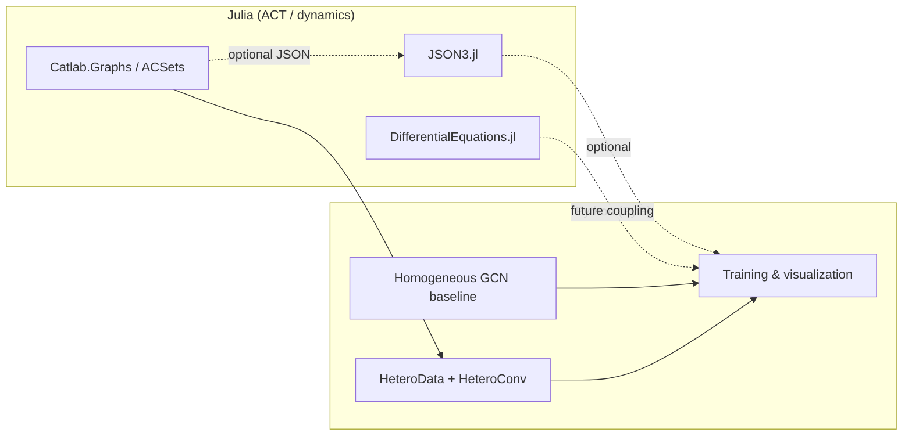

# Physics-Informed Surrogate Modeling via Applied Category Theory (ACT–GNN) — Phase 2

[](https://julialang.org/)
[](https://www.python.org/)
[](https://pytorch-geometric.readthedocs.io/)

[🇺🇸 English](#english) | [🇯🇵 日本語](#japanese)

---

<a id="english"></a>

## English

### Title & overview

**ACT–GNN Phase 2** is a research-grade, minimal but sharp codebase that studies **physics-informed graph surrogates** under two complementary pressures that appear in deep-tech R&D: **variable problem scale** (mesh / graph cardinality) and **multiphysics compositionality** (distinct interaction laws on the same substrate).

Building on a Phase‑1 narrative (structure-blind models vs graph structure), Phase 2 foregrounds the **categorical reading of heterogeneous graphs**: typed interactions (e.g., spring-like vs damper-like channels) are not merely “different edge attributes” but **first-class morphisms** that should be **separated at the schema level** and then instantiated in **PyTorch Geometric** as `HeteroData` + `HeteroConv`.

| Layer | Role in this repository |
| --- | --- |
| **Julia / ACT** | `Catlab.jl` + `Catlab.Graphs` for principled graph construction and a sanity check of the categorical tooling chain (`test_catlab.jl`). `Project.toml` also pins **DifferentialEquations.jl** and **JSON3.jl** for dynamics-oriented extensions and data interchange—aligned with a Julia-first modeling → Python-first training split. |
| **Python / PyG** | Surrogate experiments: **scale-stability** of message passing vs fixed-geometry MLPs (`demo1_scale_generalization.py`), and **multiphysics** spring–damper chains with homogeneous vs hetero GCNs (`demo2_category_multiphysics.py`). |

**Physics focus (implemented).** Node states are **2D** \([u, v]\): position and velocity along a 1D chain. **Springs** contribute forces proportional to **displacement** \((u_j - u_i)\); **dampers** contribute forces proportional to **velocity difference** \((v_j - v_i)\). One-step **semi-implicit Euler** targets provide a clean, differentiable supervised signal for surrogate learning.

**Tech stack (from source & manifests).** Julia: `Catlab`, `DifferentialEquations`, `JSON3`. Python: `torch`, `torch_geometric`, `matplotlib`. Optional: CUDA for larger workloads (`test_gpu.py`).

### Architecture

The repository is organized as a **two-language research pipeline** that mirrors how many labs operate: **declarative physics / combinatorics in Julia**, **differentiable learning in Python**.

1. **Categorical modeling (Julia).**  
   `test_catlab.jl` constructs a small graph in `Catlab.Graphs`, treating vertices as **objects** and edges as **generating morphisms** of an incidence structure. This is the lightweight “ACT spine” of the repo: it validates the Julia stack and documents the intent that **larger ACSets / C-sets** can prescribe typed wires (mass, spring, damper, …) before export.

2. **Schema materialization → deep learning (Python).**  
   `demo2_category_multiphysics.py` **instantiates** that idea without JSON: spring and damper adjacencies are built as disjoint relation types, assembled into `HeteroData`, and processed with **parallel `GCNConv` stacks** inside `HeteroConv` so spring and damper channels **do not share parameters**—a direct analogue of “different hom-sets” in a categorical presentation.

3. **Optional round-trip (JSON bridge).**  
   `compare_loss_visualization.py` is written for a **Catlab-exported** topology (`graph_from_catlab.json`) and a small PyG loader module. Generated `*.json` graphs are **gitignored** by design; the loader is not shipped in the current tree revision. Treat this script as an **optional extension** if you restore or supply those assets—conceptually it closes the loop: **Julia incidence → JSON → `torch_geometric.data.Data` → trained surrogate**.



### File structure

| Path | Description |
| --- | --- |
| `Project.toml` / `Manifest.toml` | Julia dependencies: **Catlab**, **DifferentialEquations**, **JSON3**. |
| `test_catlab.jl` | Minimal Catlab graph smoke test; entry point for the Julia side. |
| `demo1_scale_generalization.py` | **Phase‑2 scale track:** random-init GNN vs MLP on \(N=10\) vs \(N=50\) chain; MLP fails by construction. |
| `demo2_category_multiphysics.py` | **Phase‑2 multiphysics track:** spring/damper multiplexed chain; trains **homogeneous** vs **category-hetero** GCN; writes `hetero_loss_comparison.png`. |
| `compare_loss_visualization.py` | **Optional:** GNN vs MLP test-loss curves on a fixed graph; expects `graph_from_catlab.json` + a PyG JSON loader (not included here). |
| `test_gpu.py` | Quick CUDA / `torch.matmul` sanity check. |
| `.gitignore` | Ignores virtualenvs and `*.json` export artifacts. |

### Quick start & usage

**Julia (categorical layer)**

```bash
cd /path/to/physics-gnn-surrogate-act
julia --project=. -e 'using Pkg; Pkg.instantiate()'
julia --project=. test_catlab.jl
```

**Python (learning layer)**

```bash
python -m venv .venv
source .venv/bin/activate   # Windows: .venv\Scripts\activate
pip install torch torch-geometric matplotlib

python demo1_scale_generalization.py
python demo2_category_multiphysics.py
python test_gpu.py
```

**Optional:** after you place `graph_from_catlab.json` and a compatible `import_catlab_json_to_pyg` (or adapt the import), run:

```bash
python compare_loss_visualization.py
```

Outputs: `hetero_loss_comparison.png` (demo 2), `loss_comparison_test.png` (optional script, when dependencies are satisfied).

### Positioning for inbound partners

Phase 2 is deliberately **small, auditable, and opinionated**: it is meant as a **portfolio-grade** artifact for R&D engineers and academic collaborators who care about **why** heterogeneous graph learning matters in multiphysics surrogates, and how **ACT-flavored modeling** in Julia can sit upstream of **PyG** training—without hiding the engineering details (indexing, typed edges, baseline comparisons).

---

<a id="japanese"></a>

## 日本語

### タイトルと概要

**ACT–GNN Phase 2** は、ディープテック企業や研究機関の R&D で現実化しやすい二つの要求—**スケール変動**（メッシュ／グラフのサイズ）と**マルチフィジックスの合成性**（同一基盤上の異なる相互作用則）—に対し、**物理情報付きグラフ・サロゲート**を検証する、研究向けのコンパクトなコードベースです。

Phase 1 で示した「構造なしモデル対グラフ」の対比を発展させ、Phase 2 では**異種グラフの圏論的読解**を前面に出します。すなわち、バネ様・ダンパ様の相互作用は単なる「エッジ属性の違い」ではなく、**スキーマ上で分離すべき morphism の型**であり、それを **PyTorch Geometric** の `HeteroData` と `HeteroConv` として具体化します。

| レイヤ | 本リポジトリでの役割 |
| --- | --- |
| **Julia / ACT** | `Catlab.jl` と `Catlab.Graphs` によるグラフ構築・圏論スタックの検証（`test_catlab.jl`）。`Project.toml` では **DifferentialEquations.jl** と **JSON3.jl** も固定しており、「Julia でモデル・Python で学習」という二段構成の拡張（連成动力学、JSON ブリッジ）を想定した構成です。 |
| **Python / PyG** | サロゲート実験: メッセージパッシングのスケール耐性 vs 固定幾何 MLP（`demo1_scale_generalization.py`）、バネ＋ダンパのマルチフィジックス直列チェーンにおける同質 GCN と Hetero GCN の比較（`demo2_category_multiphysics.py`）。 |

**実装されている物理。** ノード状態は 2 次元 \([u, v]\)（位置・速度）。**バネ**は変位 \((u_j-u_i)\) に比例する力、**ダンパ**は速度差 \((v_j-v_i)\) に比例する力を与え、**陽的オイラー**による 1 ステップ先状態を教師信号とします。

**技術スタック（ソース・マニフェスト由来）。** Julia: `Catlab`, `DifferentialEquations`, `JSON3`。Python: `torch`, `torch_geometric`, `matplotlib`。GPU 利用時は `test_gpu.py` で環境確認が可能です。

### アーキテクチャ

多くの研究室と同様、**Julia で宣言的・組合せ的モデリング**、**Python で可微分学習**という二言語パイプラインです。

1. **圏論的モデリング（Julia）**  
   `test_catlab.jl` は `Catlab.Graphs` 上で小さなグラフを構成し、頂点を**対象**、辺を**生成 morphism** とみなす最小例です。大規模な ACSets / C-set で質量・バネ・ダンパなどの型付き配線を規定し、エクスポートへ繋げる意図を示す「ACT の背骨」です。

2. **スキーマの具現化 → 深層学習（Python）**  
   `demo2_category_multiphysics.py` は JSON を経由せず、バネ辺とダンパ辺を**別関係**として構築し `HeteroData` に載せ、`HeteroConv` 内で **独立した `GCNConv`** として学習します。圏論的プレゼンテーションにおける「異なる hom の分離」の直接的な実装です。

3. **オプションの往復（JSON ブリッジ）**  
   `compare_loss_visualization.py` は **Catlab 由来の位相**（`graph_from_catlab.json`）と PyG 用ローダを前提にしています。生成 JSON は `.gitignore` で除外されており、現リビジョンではローダは同梱されていません。資産を復元・用意した場合の**拡張トラック**として位置づけられます：Julia のインシデンス構造 → JSON → `Data` → 学習。

### ファイル構成

| パス | 説明 |
| --- | --- |
| `Project.toml` / `Manifest.toml` | Julia 依存: **Catlab**, **DifferentialEquations**, **JSON3**。 |
| `test_catlab.jl` | Catlab グラフのスモークテスト。Julia 側のエントリ。 |
| `demo1_scale_generalization.py` | **Phase 2 スケール軸:** \(N=10\) 設計の MLP と、\(N=50\) でも動作する GNN の対比（学習なし・初期化のみ）。 |
| `demo2_category_multiphysics.py` | **Phase 2 マルチフィジックス軸:** 同質 GCN と Hetero GCN の学習比較。`hetero_loss_comparison.png` を出力。 |
| `compare_loss_visualization.py` | **任意:** 固定グラフ上の GNN vs MLP のテスト損失。`graph_from_catlab.json` と JSON→PyG ローダが必要（本ツリーには未同梱）。 |
| `test_gpu.py` | CUDA / `torch.matmul` の簡易確認。 |
| `.gitignore` | 仮想環境と `*.json` 出力の除外。 |

### クイックスタート・使い方

**Julia（圏論・モデリング側）**

```bash
cd /path/to/physics-gnn-surrogate-act
julia --project=. -e 'using Pkg; Pkg.instantiate()'
julia --project=. test_catlab.jl
```

**Python（学習パイプライン側）**

```bash
python -m venv .venv
source .venv/bin/activate   # Windows: .venv\Scripts\activate
pip install torch torch-geometric matplotlib

python demo1_scale_generalization.py
python demo2_category_multiphysics.py
python test_gpu.py
```

**任意:** `graph_from_catlab.json` と互換の `import_catlab_json_to_pyg`（等）を配置・復元したうえで:

```bash
python compare_loss_visualization.py
```

出力: デモ2で `hetero_loss_comparison.png`、任意スクリプトで条件が揃えば `loss_comparison_test.png`。

### インバウンド向けの位置づけ

Phase 2 は**小さく監査可能で主張が明確**な構成にしています。マルチフィジックス環境で**なぜ**異種グラフ学習が効くのか、Julia 側の **ACT 風モデリング**を PyG 学習の上流に置くときの**設計意図**（インデックス、型付き辺、ベースライン比較）を隠さない—ハイエンドなポートフォリオとして、海外の R&D エンジニア・研究者との技術対話のたたき台になることを想定しています。
